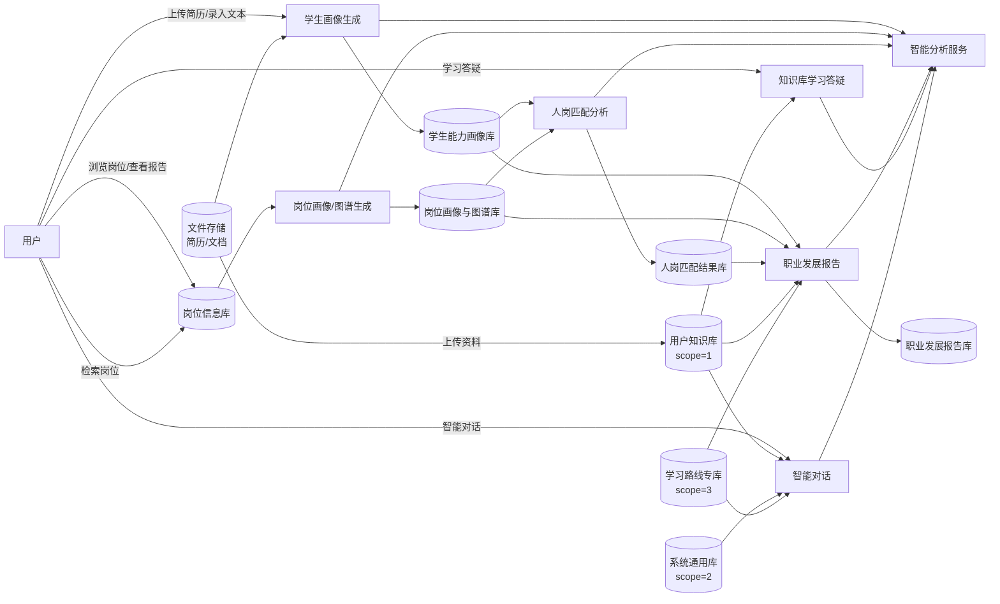

# 职点迷津：基于 AI 的大学生职业规划智能体——系统需求规约文档（SRS）

小组成员：2351279 尹诚成 2352985 张翔 2354171 徐浩然

---

## 目录

1. [引言](#1-引言)
2. [系统概述](#2-系统概述)
3. [功能需求](#3-功能需求)
4. [非功能需求](#4-非功能需求)
5. [系统设计原则](#5-系统设计原则)
6. [技术选型](#6-技术选型)
7. [数据流图](#7-数据流图)
8. [总结](#8-总结)

---

## 1 引言

### 1.1 项目背景

- **项目名称**：职点迷津 — 基于 AI 的大学生职业规划智能体
- **项目总体目标**：
  1. 构建面向计算机类信息化岗位的**就业岗位要求画像**与**岗位关联图谱**，帮助学生理解岗位技能要求与发展路径；
  2. 支持简历上传或文本录入，利用大语言模型生成**学生就业能力画像**，并给出完整度与能力评分；
  3. 在「基础要求、职业技能、职业素养、发展潜力」四维权重框架下完成**可解释的人岗匹配分析**；
  4. 聚合画像、匹配结果与职业路径，生成**可操作、可编辑**的职业生涯发展报告（当前版本在线阅读，报告导出见 §8.2 未来计划）；
  5. 提供**求职准备阶段**的知识库与学习答疑能力，支持上传学习/项目类资料并针对材料提问，辅助知识积累与项目梳理（与面试模拟等后续环节区分）；
  6. 维护**分层系统知识库**（系统通用资料与学习路线专库），支撑职业发展报告中的学习路径建议与智能对话中的可选检索；
  7. 提供**独立智能对话**，支持按需选用系统知识库与用户知识文档辅助回答。

### 1.2 大学生职业规划痛点

针对上述就业与规划困境，本系统重点回应以下痛点：

1. **自我认知模糊**：专业与能力选择缺乏系统剖析，易跟风考研、考公或进大厂，忽视个人特质与岗位匹配。
2. **职业信息片面**：对行业与岗位的认知多来自社交媒体碎片信息，对新兴领域技能要求与风险判断不足。
3. **外部指导薄弱**：高校课程偏理论，缺乏贴合一线的个性化建议；家庭干预过度或缺位。
4. **规划难以落地**：缺少实习与项目验证，面对行业快速迭代缺乏动态调整能力。

### 1.3 用户期望与系统指标

学生通过本系统应能够：

| 序号 | 用户期望                                     | 系统对应能力                                             |
| ---- | -------------------------------------------- | -------------------------------------------------------- |
| 1    | 快速了解应届生岗位能力要求，并拆解具体能力项 | 岗位库检索、岗位能力画像（七维）、岗位关键词             |
| 2    | 清晰分析自身就业能力与就业意愿               | 简历/文本解析、学生能力画像、能力评分与完整度评分        |
| 3    | 获得可操作的生涯报告与行动计划               | 人岗匹配、职业图谱、发展报告（探索/目标/路径/计划/评估） |

**系统核心指标（需求编号）**：

| 指标类别 | 要求摘要                                              | 本系统需求编号 |
| -------- | ----------------------------------------------------- | -------------- |
| 岗位画像 | ≥10 个岗位类型画像；七维能力要求                     | FR-JOB-01      |
| 岗位图谱 | 垂直晋升路径；≥5 条换岗路径，每条 ≥2 节点           | FR-JOB-02      |
| 学生画像 | 简历上传或录入；七维画像；完整度/能力评分             | FR-STU-01      |
| 生涯报告 | 探索匹配、目标与路径、短中期计划、润色/检查/编辑       | FR-RPT-01      |
| 人岗匹配 | 四维分析 + 权重综合打分；生成内容可解释               | FR-MAT-01      |
| 大模型   | 至少一个 LLM 用于画像、匹配、报告等                   | NFR-AI-01      |

---

## 2 系统概述

### 2.1 系统目标

系统旨在为在校大学生提供「数据驱动的职业规划智能体」，贯通岗位认知、能力自省、量化匹配与行动规划，支撑求职决策与长期发展。

#### 2.1.1 岗位与图谱目标

1. 管理计算机类信息化岗位数据集（约 1 万条原始记录），支持检索与详情查看。
2. 基于职位描述生成**岗位能力画像**。
3. 生成**垂直晋升图谱**与**换岗路径图谱**。
4. 覆盖不少于 **10 种**岗位角色类型的专用画像归纳策略（如 Java 后端、前端、测试、算法、大数据等）。

#### 2.1.2 学生画像目标

1. 支持简历 PDF 或原始文本作为输入。
2. 将非结构化简历拆解为**七维就业能力画像**（专业技能、获奖经历、创新/学习/抗压/沟通/实习能力）。
3. 输出**能力评分**及分项明细、改进建议、岗位类型识别置信度。
4. 支持教育经历、项目经历、技能、求职意向等结构化档案维护。

#### 2.1.3 匹配与报告目标

1. 按“基础要求、职业技能、职业素养、发展潜力”四维对比岗位与学生画像，加权计算综合匹配度。
2. 输出维度得分、证据、亮点、差距、关键词命中/缺失及**关键技能匹配率**。
3. 生成结构化职业生涯发展报告，含职业探索、目标、路径、短中期行动计划、评估周期及**学习路径建议**（结合用户资料与学习路线专库）。
4. 支持报告智能润色、完整性检查、手动编辑与版本管理；简历分析结果支持 PDF 导出。

#### 2.1.4 平台与交互

1. 保障用户级数据隔离，各用户仅可访问本人数据。
2. 提供求职准备向**个人知识库**（每用户一份）：文档上传、向量化索引与基于本人材料的学习答疑（非面试模拟）。
3. 维护**系统知识库**两层：系统通用资料（行业趋势、求职建议等）与学习路线专库（与校招岗位类型对齐的标准学习路径）；支持运维侧离线批量向量化入库。
4. 提供多轮会话、消息历史；会话内可按需选用系统知识库（含通用与学习路线）与用户知识文档辅助回答。
5. 支持 Docker 一键部署与 CI 自动化测试。

### 2.2 系统功能概述

| 子系统                     | 功能摘要                                                            |
| -------------------------- | ------------------------------------------------------------------- |
| **简历与档案**       | 每用户一份简历；整页维护教育/工作/项目/技能；一次全量保存；PDF 识别导入、简历 PDF 导出 |
| **学生能力画像**     | 从 PDF/文本生成画像、查看当前画像、能力评分与改进建议               |
| **岗位服务**         | 岗位浏览与筛选、岗位能力画像生成/查看、职业图谱生成/查看            |
| **人岗匹配**         | 按目标岗位发起匹配分析、查看历史匹配结果                            |
| **职业发展报告**     | 按岗位生成报告、查询最新报告、润色、完整性检查、手动编辑保存        |
| **知识库与学习答疑** | 个人资料管理、向量化索引、基于本人材料的学习答疑                    |
| **系统知识库**       | 系统通用资料与学习路线专库；运维离线导入；供报告与对话检索          |
| **会话与消息**       | 会话管理、流式聊天、可选引用系统/用户知识库（多库合并检索）         |
| **文件服务**         | 简历文件、知识库文件上传                                            |

### 2.3 系统架构概述

系统采用**前后端分离**架构：用户在浏览器中使用 Web 界面完成操作，业务逻辑由服务端统一处理并返回结果；业务数据持久保存，文件与大容量资料单独存放，智能分析由外部大模型服务支撑。具体技术选型见第 6 章。

#### 2.3.1 用户交互层

- **职责**：呈现页面、接收用户输入、展示画像/图谱/报告与流式对话结果。
- **主要功能域**：首页门户、岗位浏览与详情、能力画像、简历编辑、知识库与学习答疑、智能对话。

#### 2.3.2 业务服务层

- **职责**：身份校验、各业务子系统编排、智能分析调用、知识检索增强、统一错误提示。
- **主要子系统**：

| 业务子系统       | 职责                                             |
| ---------------- | ------------------------------------------------ |
| 用户认证         | 注册、登录、验证码、登录态校验                   |
| 简历与档案       | 每用户一份简历；结构化经历与技能维护；全量保存与识别导入 |
| 学生能力画像     | 从简历/文本生成与查询个人能力画像                |
| 岗位服务         | 岗位浏览、岗位能力画像、职业路径图谱             |
| 人岗匹配         | 四维对比分析与匹配结果留存                       |
| 职业发展报告     | 报告生成、scope 1+3 学习路径 RAG、润色、完整性检查、编辑与版本管理 |
| 知识库与学习答疑 | 个人资料管理、向量化、基于本人材料的准备阶段答疑                   |
| 系统知识库       | scope 2/3 运维离线导入；供报告与对话只读检索                     |
| 会话与消息       | 多轮对话、历史记录、可选多库知识来源（1+2+3）                    |
| 文件服务         | 简历与知识文档的上传与访问                       |
| 公共支撑         | 访问限流、统一异常与错误提示、外部存储与模型接入 |

#### 2.3.3 数据与外部能力层

- **业务数据库**：用户账号、岗位信息、学生/岗位画像、匹配结果、报告版本、知识库索引等。
- **缓存服务**：登录态维护、高频访问限流等。
- **文件存储**：简历 PDF、知识文档等大文件。
- **智能分析服务**：大模型推理，支撑画像、匹配、报告、图谱生成及流式对话。

#### 2.3.4 安全与运维支持

- 业务功能须登录后访问；各用户仅能访问本人简历、画像、匹配、报告、知识库与会话数据。
- 成功与失败提示格式全站统一，对用户展示可读说明，不暴露系统内部技术细节。
- 支持容器化一键部署与持续集成自动化测试（详见 2.1.4、4.5、6.4）。

---

## 3 功能需求

本章从**用户视角**描述职点迷津对外提供的业务能力：用户是谁、要完成什么目标、看到什么结果、系统应如何反馈。接口、数据库、算法等实现细节不在本章展开。

**用户角色**

| 角色 | 说明                                                                     |
| ---- | ------------------------------------------------------------------------ |
| 用户 | 在册学生；可使用职业规划、画像、匹配、报告、知识库与对话等全部业务功能。 |

### 3.1 简历与个人就业能力画像

#### 3.1.1 功能概述

学生上传简历或录入经历后，系统将其整理为结构化的**就业能力画像**，从多维度描述「我会什么、强在哪里、待提升什么」，并给出能力评分与改进建议，作为后续岗位匹配与生涯报告的基础。

#### 3.1.2 用例图

| 用例           | 用户价值                                 |
| -------------- | ---------------------------------------- |
| 管理简历与档案 | 整页维护教育、工作/实习、项目、技能，一次保存全部变更 |
| 上传简历文件   | 用 PDF 快速导入经历，减少手工录入        |
| 录入简历文本   | 直接粘贴或输入文本，无需准备 PDF 文件    |
| 生成能力画像   | 一键获得多维度能力解读与评分             |
| 查询能力画像   | 随时查看最新画像与历史分析结果           |
| 导出简历 PDF   | 将编辑好的简历导出为可投递的 PDF         |

#### 3.1.3 活动图

#### 3.1.4 功能需求

| 编号      | 功能     | 用户操作与系统表现                                                                                                                             |
| --------- | -------- | ---------------------------------------------------------------------------------------------------------------------------------------------- |
| FR-STU-01 | 录入方式 | 支持上传简历 PDF，或直接输入/粘贴简历文本；至少提供一种有效内容方可生成画像。                                                                  |
| FR-STU-02 | 能力维度 | 画像从**专业技能、荣誉与证书、创新能力、学习能力、抗压能力、沟通能力、实习与实践能力**等维度呈现，文字说明须可读、可理解，避免空泛套话。 |
| FR-STU-03 | 能力评分 | 提供 0～100 分的**能力评分**及简要解读；可附带简历完整度、内容质量等分项说明，帮助学生知悉「强在哪、弱在哪」。                           |
| FR-STU-04 | 改进建议 | 给出可执行的改进建议列表（如补充项目经历、强化某类技能），与画像内容一致。                                                                     |
| FR-STU-05 | 方向识别 | 可提示系统推断的求职方向类型及置信程度，供学生参考（非强制采纳）。                                                                             |
| FR-STU-06 | 简历编辑 | 支持在线整页编辑简历（教育、工作/实习、项目、技能等模块）；采用**单一保存**提交全部变更，无需按模块分别保存。 |
| FR-STU-07 | 结果留存 | 生成后的画像可再次打开查看，无需每次重新上传简历（除非用户主动更新并重新生成）。 |
| FR-STU-08 | 全量保存 | 用户一次提交后，系统在同一事务内保存技能与各经历：带标识的项更新、无标识的项新增、未出现在提交列表中的既有项删除；任一步失败则整体回滚。 |

#### 3.1.5 业务规则

- 分析结论应基于用户提供的简历/文本，**不得虚构**用户未提及的技能或经历。
- 同一份材料重新生成时，覆盖或更新为最新版本，并向用户标明为最新结果。
- **每名在册用户仅维护一份简历**；重复创建应被拒绝。
- **简历内容即该用户全部结构化经历**（教育、工作/实习、项目）及关联技能；不提供「是否在简历中展示」类字段或筛选。
- 在线编辑时，用户编辑的是完整快照；保存时按标识 diff，保留项目等记录的既有分析状态（如 AI 分析结果），不因普通字段修改而丢失。

---

### 3.2 岗位浏览、岗位画像与职业路径

#### 3.2.1 功能概述

学生可浏览真实岗位信息，查看岗位的任职要求，并查看该岗位在职场中的**晋升路径**与**可转换的其他岗位方向**，从而建立对就业市场的清晰认知。

#### 3.2.2 用例图

| 用例                  | 用户价值                                       |
| --------------------- | ---------------------------------------------- |
| 检索/筛选岗位         | 按行业、薪资、公司、职位名称等条件找到目标岗位 |
| 查看岗位详情          | 了解职位描述、公司情况、薪资与地点等           |
| 生成/查询岗位能力画像 | 将冗长招聘说明提炼为结构化的能力要求           |
| 生成/查询职业关联图谱 | 查看晋升阶梯与换岗可能性                       |

#### 3.2.3 活动图

#### 3.2.4 功能需求

| 编号      | 功能         | 用户操作与系统表现                                                                                                                               |
| --------- | ------------ | ------------------------------------------------------------------------------------------------------------------------------------------------ |
| FR-JOB-01 | 岗位浏览     | 提供岗位列表与多条件筛选（如行业、公司规模、薪资区间、实习/全职、职位关键词等）；点击进入详情页查看完整招聘信息。                                |
| FR-JOB-02 | 岗位能力画像 | 用户可对某岗位生成「能力要求画像」，从专业技能、证书资质、创新/学习/抗压/沟通/实践等维度归纳**该岗位需要什么**；支持再次打开已生成的画像。 |
| FR-JOB-03 | 岗位类型覆盖 | 系统须支持不少于**10 类**常见信息化岗位（如后端开发、前端、测试、算法、数据分析、运维、安全等）的能力解读，避免仅适用于单一岗位。          |
| FR-JOB-04 | 垂直晋升路径 | 职业图谱中展示从当前/入门岗位向上的晋升序列（不少于 3 个层级），含岗位名称、职责要点、能力要求、典型成长年限等。                                 |
| FR-JOB-05 | 换岗路径     | 展示不少于**5 条**可转换的职业方向；每条路径不少于 **2 个**阶段节点，并说明转岗理由、难度及需补齐的能力。                            |
| FR-JOB-06 | 当前位置标注 | 图谱中明确标出「当前关注岗位」在路径中的位置，便于学生对照自身目标。                                                                             |

#### 3.2.5 业务规则

- 岗位数据来源于系统预置的岗位库（含职位名称、地点、薪资、公司、行业、职位描述等）。
- 能力画像与职业图谱以岗位招聘说明为依据归纳；招聘说明中未提及的要求应标注为「未明确」或同等语义，避免误导。

---

### 3.3 人岗匹配分析

#### 3.3.1 功能概述

在学生已具备**个人能力画像**且目标岗位已具备**岗位能力画像**的前提下，学生可发起匹配分析，系统从多个维度对比「岗位要求」与「我的能力」，给出综合匹配度、分项得分、优势亮点与待补齐差距，帮助学生对该岗位的契合度。

#### 3.3.2 用例图

| 用例         | 用户价值                                                 |
| ------------ | -------------------------------------------------------- |
| 发起人岗匹配 | 对目标岗位发起四维对比，获得综合匹配度与可解释说明       |
| 查看匹配结果 | 随时打开该岗位最近一次匹配分析，了解优势、差距与技能覆盖 |
| 重新匹配     | 画像更新后再次分析，覆盖为最新结果                       |

#### 3.3.3 活动图

#### 3.3.4 功能需求

| 编号      | 功能       | 用户操作与系统表现                                                                                                                                                                                 |
| --------- | ---------- | -------------------------------------------------------------------------------------------------------------------------------------------------------------------------------------------------- |
| FR-MAT-01 | 发起匹配   | 学生在岗位详情或匹配入口选择「分析匹配度」；分析完成后展示结果页。                                                                                                                                 |
| FR-MAT-02 | 分析维度   | 至少从以下四类对比并分别打分（0～100）：**基础要求**（学历、证书等）、**职业技能**（专业与技能匹配）、**职业素养**（沟通、抗压等）、**发展潜力**（学习、实践、成长空间）。 |
| FR-MAT-03 | 综合匹配度 | 在分项基础上给出**综合匹配度**（0～100），并说明各维度在综合分中的权重逻辑（可用通俗语言或图示，让学生理解「为何是这个总分」）。                                                             |
| FR-MAT-04 | 可解释说明 | 展示：与岗位匹配的优势点（若干条）、影响录用的关键差距（若干条）、已覆盖与未覆盖的岗位关键技能词、一段文字总结。说明须引用学生画像与岗位要求中的依据，避免空泛评价。                               |
| FR-MAT-05 | 历史结果   | 对同一岗位可查看最近一次匹配结果；用户更新画像后可重新分析并覆盖原结果。                                                                                                                           |
| FR-MAT-06 | 前置提示   | 若尚未生成个人画像或岗位画像，系统明确提示须先完成哪一步，并提供跳转入口（如「去生成能力画像」）。                                                                                                 |

#### 3.3.5 业务规则

- 仅分析**当前用户**本人的画像，不可查看他人匹配结果。
- 关键技能匹配程度应可理解（如「岗位要求的 10 项核心技能中，您已体现 8 项」）；系统内部质量目标为关键技能匹配率不低于 80%。

---

### 3.4 职业生涯发展报告

#### 3.4.1 功能概述

针对某一目标岗位，系统为学生生成一份结构化的**职业生涯发展报告**：说明人与岗是否契合、可设定怎样的职业目标、中长期发展路径如何、短期与中期应完成哪些行动，并支持润色、完整性检查与手动修改，形成可指导实际行动的规划文档。

#### 3.4.2 用例图

| 用例             | 用户价值                                         |
| ---------------- | ------------------------------------------------ |
| 生成职业发展报告 | 针对目标岗位一键获得结构化生涯规划文档           |
| 查看报告         | 随时打开该岗位最新版报告，无需重复生成           |
| 润色报告         | 在事实不变前提下优化表述，生成可读性更好的新版本 |
| 完整性检查       | 一键检查缺章与过短项，获得完整度评分与修改建议   |
| 编辑保存报告     | 手工调整内容并保存，形成符合个人需求的定制版本   |

#### 3.4.3 活动图

#### 3.4.4 功能需求

| 编号      | 功能       | 用户操作与系统表现                                                                                                                                                                                                                                                     |
| --------- | ---------- | ---------------------------------------------------------------------------------------------------------------------------------------------------------------------------------------------------------------------------------------------------------------------- |
| FR-RPT-01 | 生成报告   | 用户选择目标岗位后一键生成；生成中显示进度或等待提示；完成后在页面分段展示报告。                                                                                                                                                                                       |
| FR-RPT-02 | 报告章节   | 报告须包含：**职业探索**（市场与岗位、人与岗契合与差距）、**职业目标**、**发展路径**（结合岗位晋升/换岗图谱）、**行动计划**（短期与中期，每阶段不少于 3 条可执行任务，含建议周期与验收方式）、**评估与调整**（何时复盘、关注哪些指标）。 |
| FR-RPT-03 | 可操作性   | 计划项须具体可执行（如学习某技能、完成某类实习、考取某证书），避免仅「努力学习」「提升能力」等空话。                                                                                                                                                                   |
| FR-RPT-04 | 真实性     | 不得编造用户简历中不存在的经历或岗位中不存在的要求；可标注依据来源（如来自匹配分析、职业路径图）。                                                                                                                                                                     |
| FR-RPT-05 | 智能润色   | 用户可对已有报告发起「润色」，在保持事实不变的前提下优化表述，生成新版本供对比或采用。                                                                                                                                                                                 |
| FR-RPT-06 | 完整性检查 | 用户可一键检查报告是否缺章、过短或关键项未填；系统给出完整度评分与缺失项清单及修改建议。                                                                                                                                                                               |
| FR-RPT-07 | 手动编辑   | 用户可直接修改报告内容并保存；保存后形成新版本，保留「最新版」标识。                                                                                                                                                                                                   |
| FR-RPT-08 | 再次查看   | 对同一岗位可打开最近一次生成的报告，无需重复生成（除非用户主动重新生成）。                                                                                                                                                                                             |
| FR-RPT-09 | 学习路径建议 | 生成报告时，系统结合目标岗位与用户偏好，从**用户个人知识库**与**学习路线专库**检索相关片段，融入「发展路径」「行动计划」等章节，给出可执行的学习路线建议（如应补哪些技能、按何种顺序学习）；须标注依据来源，无有效命中时不编造路线。 |

#### 3.4.5 业务规则

- 生成报告前，须已完成**个人能力画像**、该岗位的**岗位能力画像**、**人岗匹配分析**及**职业路径图谱**；缺项时逐项提示。
- 报告生成时的知识检索范围为**用户个人知识库（scope=1）+ 学习路线专库（scope=3）**：前者提供用户已上传笔记、项目材料等个性化上下文，后者提供与校招岗位对齐的标准学习路径；**不检索**系统通用资料库（scope=2）。
- 用户个人知识库为空时，报告仍可基于学习路线专库生成通用学习建议；须避免编造用户未提及的经历。

---

### 3.5 求职准备知识库与学习答疑

#### 3.5.1 功能概述

本模块面向**求职准备阶段**（投递与面试之前），帮助学生围绕**知识学习、项目理解与材料消化**开展积累，而非模拟面试或面经训练。

学生可上传与准备相关的个人资料，例如：专业课程与笔记、技术学习文档、**项目说明/复盘材料**、竞赛或科研记录、行业与岗位认知类读物等；在**个人知识库**中可存放多份文件，针对已上传内容提问，系统结合文档检索与通用能力作答，支持：

- **知识学习**：解释概念、梳理知识脉络、对照资料回答「是什么 / 为什么 / 怎么学」；
- **项目分析**：结合用户上传的项目描述，协助厘清技术栈、个人贡献、亮点与可改进点（须基于材料，不编造未提及经历）；
- **准备答疑**：对材料中的疑难句段、术语或规划类问题作连续追问。

本模块与画像、匹配、报告等**主线职业规划功能相互独立**，不自动引用其他模块的分析结果；**也不承担**面试题演练、模拟面试、面经对答等**面试阶段**能力（见 8.2 未来计划中的模拟面试项）。

#### 3.5.2 用例图

| 用例             | 用户价值                                         |
| ---------------- | ------------------------------------------------ |
| 管理个人知识库   | 查看与整理个人准备资料集合，统筹求职学习材料     |
| 上传准备资料     | 添加课程笔记、项目文档等材料，为后续答疑建立索引 |
| 删除文档         | 移除过时或错误资料，保持知识库整洁               |
| 查看文档处理状态 | 了解资料是否已解析完成、可否用于答疑             |
| 对话答疑         | 就已上传材料提问，获得基于检索的流式解答         |
| 项目材料梳理     | 围绕项目说明问答式厘清技术栈、个人贡献与可改进点 |

#### 3.5.3 活动图

#### 3.5.4 功能需求

| 编号     | 功能         | 用户操作与系统表现                                                                                                                                           |
| -------- | ------------ | ------------------------------------------------------------------------------------------------------------------------------------------------------------ |
| FR-KB-01 | 知识库管理   | 每位用户拥有一个个人知识库集合；可在其中上传、删除多份文档（支持常见文档格式，如课程笔记、项目说明等）。                                                     |
| FR-KB-02 | 文档处理     | 上传后系统后台完成解析与索引；处理中提示「处理中」，完成后可用于学习答疑。                                                                                   |
| FR-KB-03 | 学习答疑     | 用户就**已上传材料**提问（如概念理解、学习路径、项目技术点、经历表述等）；系统流式输出回答，优先依据知识库检索结果，并支持多轮连续追问。               |
| FR-KB-04 | 数据隔离     | 用户仅能访问本人的知识库与文档，无法查看他人资料。                                                                                                           |
| FR-KB-05 | 准备阶段定位 | 模块能力边界为求职**准备阶段**；不提供模拟面试、结构化面经问答或「以面试官视角打分」等**面试阶段**功能；回答须基于用户材料，不得虚构项目或经历。 |
| FR-KB-06 | 系统知识库（只读） | 平台维护两类系统向量化资料，全体用户只读：**系统通用库**（行业趋势、求职建议等）与**学习路线专库**（与 10 类校招岗位及共用基础栈对齐的标准学习路径）；由运维通过离线脚本批量导入，用户不可直接修改。 |

#### 3.5.5 业务规则

- 每位用户拥有**一个**个人知识库（scope=1），可在其中上传与管理**多份**文档；用户仅能访问本人资料。
- **学习答疑专页**（本模块）**仅**检索当前用户的个人知识库，**不**引用系统知识库，**不**自动读取能力画像、人岗匹配或职业发展报告。
- **系统知识库**分为两层：**scope=2 系统通用库**、**scope=3 学习路线专库**；`user_id` 约定为 `0`，与真实用户隔离。学习路线内容须与系统支持的校招岗位类型（如 Java 后端、前端、测试、AI Agent、算法、数据分析、大数据、DevOps、安全、C++ 等）及跨岗共用基础（计算机基础、算法、Git、Linux 等）对齐；与上述岗位无明显关联的方向（如原生移动、游戏、区块链等）不纳入学习路线专库。
- 系统知识库文档由运维侧**离线批量向量化**写入；嵌入模型、向量维度与分块策略须与线上一致，以保证报告与对话检索结果可比。
- 文档须完成后台索引后方可作为答疑依据；处理中或索引失败的文档不得用于检索增强作答。
- 回答须严格依据检索到的用户材料；检索无有效命中时须向用户说明，并**不得编造**材料中未出现的项目、技能或经历。
- 模块能力边界为求职**准备阶段**（知识学习、项目材料理解、准备答疑），**不提供**模拟面试、面经对答或面试官打分等面试阶段能力。
- 知识检索相关参数（如召回条数、相关度阈值等）由系统内置，用户不可自行配置。

---

### 3.6 智能对话

#### 3.6.1 功能概述

学生可在**独立**对话界面进行多轮职业相关提问与交流（不局限于某一份上传文档）。系统在同一会话内记住上下文并流式返回答案。**当前版本**对话不自动携带能力画像、人岗匹配或职业发展报告等主线分析结果；用户若需结合上述结论，须自行在问题中说明。

用户可按需选择是否在回答时引用以下知识来源（可单独开启、同时开启或均不开启）：

- **系统知识库**：平台维护的向量化资料，含**系统通用库**（行业认知、求职建议等）与**学习路线专库**（标准技能学习路径）；启用后合并检索 scope=2 与 scope=3；
- **用户知识文档**：本人在 **3.5** 中上传并已索引的准备阶段资料（课程笔记、项目说明等），对应 scope=1 个人库。

未启用任何知识来源时，系统仅依据会话历史与一般模型能力作答；启用后，系统在生成回答前检索相应来源中的相关片段并融入回答；若无有效命中，须说明并退回一般作答，**不得编造**文档中不存在的内容。

与 **3.5 学习答疑** 的区分：3.5 为知识库专页，默认围绕**用户已上传材料**开展准备阶段学习与项目梳理；3.6 为通用对话场景，知识引用为**可选项**，且可额外选用**系统知识库**；**不提供**模拟面试等面试阶段能力。

#### 3.6.2 用例图

| 用例         | 用户价值                                       |
| ------------ | ---------------------------------------------- |
| 管理会话     | 新建、切换与删除对话主题，组织多轮职业交流     |
| 配置知识来源 | 按需启用系统知识库或用户文档，控制回答依据范围 |
| 发送消息     | 输入职业相关问题并提交，发起新一轮对话         |
| 接收流式回复 | 逐段查看助手回答，减少长时间等待的焦虑感       |
| 查看历史消息 | 翻阅会话内过往问答，延续上下文交流             |

#### 3.6.3 活动图

#### 3.6.4 功能需求

| 编号       | 功能         | 用户操作与系统表现                                                                                                                                             |
| ---------- | ------------ | -------------------------------------------------------------------------------------------------------------------------------------------------------------- |
| FR-CHAT-01 | 会话管理     | 用户可新建多个对话主题，查看历史会话列表，进入某会话继续交流。                                                                                                 |
| FR-CHAT-02 | 消息交互     | 用户发送文字问题，系统逐字或分段返回回答；长时间生成时显示「正在输入」或加载状态。                                                                             |
| FR-CHAT-03 | 历史记录     | 会话内历史消息可翻阅，按时间顺序展示过往问答。                                                                                                                 |
| FR-CHAT-04 | 知识来源选择 | 用户可配置本会话是否引用**系统知识库**与**用户知识文档**（二者可独立开关）；启用后回答优先依据检索到的片段，无命中时须说明并退回一般作答，不编造。 |
| FR-CHAT-05 | 多库检索     | 启用知识来源时，检索范围为：**用户个人库（scope=1）+ 系统通用库（scope=2）+ 学习路线专库（scope=3）**（按用户配置取子集）；多库结果按相似度合并去重后截断 Top-K，避免单一库独占命中。 |

#### 3.6.5 业务规则

- 智能对话为**独立**模块，**不自动引用**能力画像、人岗匹配或职业发展报告；用户若需结合上述结论，须在问题中自行说明。
- 用户可按**会话**独立配置是否引用**系统知识库**与**用户知识文档**（二者可单独开启、同时开启或均不开启）；配置对当前会话后续消息生效，可随时修改。
- 未启用任何知识来源时，系统仅依据会话历史与一般模型能力作答。
- 启用知识来源后，须在生成回答前按当前配置在 scope **1～3** 范围内合并检索；用户文档对应 scope=1，系统知识库对应 scope=2+3；检索无有效命中时须说明并退回一般作答，**不得编造**文档或知识库中不存在的内容。
- 用户仅能查看与管理本人的会话与历史消息。

---

## 4 非功能需求

### 4.1 性能需求

| 编号     | 要求                                                              |
| -------- | ----------------------------------------------------------------- |
| NFR-P-01 | 岗位列表分页查询：常规筛选条件下 P95 响应时间 ≤ 2s（不含冷启动） |
| NFR-P-02 | 结构化智能分析（画像/匹配/报告）：单次同步请求 P95 ≤ 60s         |
| NFR-P-03 | 流式对话首包延迟 ≤ 5s                                            |
| NFR-P-04 | 知识库检索 P95 ≤ 3s                                              |
| NFR-P-05 | 对登录态与热点数据采用缓存，降低数据库访问压力                    |

### 4.2 安全性需求

| 编号     | 要求                                                                                       |
| -------- | ------------------------------------------------------------------------------------------ |
| NFR-S-01 | 业务功能须登录后访问；未授权请求应被拒绝并引导重新登录                                     |
| NFR-S-02 | 用户数据按账号行级隔离，用户仅能访问本人简历、画像、匹配、报告与知识库                     |
| NFR-S-03 | 用户密码须加密存储；生产环境传输须采用 HTTPS 等安全协议                                    |
| NFR-S-04 | 登录、验证码及高频校验接口须限流，防止滥用                                                 |
| NFR-S-05 | 数据库、缓存、对象存储及模型服务等敏感凭据须通过部署环境配置注入，禁止硬编码或写入业务数据 |
| NFR-S-06 | 关键业务操作须记录可追溯日志；系统异常对用户仅展示友好提示，不暴露内部技术细节             |

### 4.3 可靠性与 AI 质量需求

| 编号      | 要求                                                                                           |
| --------- | ---------------------------------------------------------------------------------------------- |
| NFR-AI-01 | 至少接入一个大语言模型，支撑画像、匹配、报告、图谱与对话等智能能力                             |
| NFR-AI-02 | 智能分析结果须以结构化形式输出并可被系统稳定解析；解析或生成失败时须给出明确、可理解的失败说明 |
| NFR-AI-03 | 模型输出须严格依据用户提供的简历、岗位描述等输入证据，不得编造未出现的经历或能力               |

### 4.4 可扩展性需求

| 编号     | 要求                                                                         |
| -------- | ---------------------------------------------------------------------------- |
| NFR-E-01 | 业务按功能域划分模块，新增岗位类型时仅需扩展相应规则与提示策略，不影响其他域 |
| NFR-E-02 | 人岗匹配权重须支持按目标岗位类型差异化配置                                   |
| NFR-E-03 | 对外提供规范的 HTTP 接口，并具备可自动生成的接口说明文档                     |
| NFR-E-04 | 每位用户拥有一个个人知识库集合，可在其中上传与管理多份文档                   |

### 4.5 可维护性需求

| 编号     | 要求                                                                     |
| -------- | ------------------------------------------------------------------------ |
| NFR-M-01 | 成功与失败响应格式须全站统一，便于前端对接与问题排查                     |
| NFR-M-02 | 业务错误须分类编号，并映射为一致的用户可见提示                           |
| NFR-M-03 | 岗位、鉴权、匹配、报告等核心模块须具备自动化测试，并在持续集成中自动执行 |
| NFR-M-04 | 关键模块具备可维护的设计说明，并与实现同步演进                           |
| NFR-M-05 | 须提供容器化或等效方式，便于开发与部署环境一键复现                       |

### 4.6 可用性与用户体验需求

| 编号     | 要求                                                       |
| -------- | ---------------------------------------------------------- |
| NFR-U-01 | 界面清晰分区：岗位探索、我的画像、匹配结果、报告、知识问答 |
| NFR-U-02 | 长耗时 AI 操作提供进度/加载与失败重试提示                  |
| NFR-U-03 | 匹配与报告结果面向学生语言，避免纯技术术语堆砌             |
| NFR-U-04 | 支持简历在线整页编辑与单一保存提交                               |

---

## 5 系统设计原则

### 5.1 高内聚低耦合

- 按业务域划分模块（简历与画像、岗位、匹配、报告、知识库、对话等），各域职责边界清晰；
- 跨业务流程（如报告生成需聚合画像、匹配与岗位信息）应集中编排，避免规则散落多处；
- 用户操作入口仅负责接收输入与返回结果，不承载业务规则与分支判断。

### 5.2 错误处理机制

- 可预期的业务失败（如资源不存在、前置条件未满足）须返回明确、一致的错误说明，便于用户理解与前端统一展示；
- 表单与参数校验失败须指出具体字段或原因；
- 未预期的系统异常须在服务端完整记录，对用户仅展示通用失败提示，不泄露内部细节；
- 智能分析生成失败须映射为对应业务场景的可读错误信息（如匹配分析失败、报告生成失败等）。

### 5.3 模块化与前后端分离

- 前端通过统一的数据访问层调用后端能力，页面与组件不直接处理通信协议细节；
- 每个用户操作由单一业务入口处理，避免在入口层串联多条业务链路；
- 智能分析所用的引导策略与各业务处理流程分开维护，便于按场景优化而不影响主流程稳定性。

### 5.4 接口设计原则

- 接口按业务资源组织（岗位、匹配、报告、知识库、会话等），路径语义清晰；
- 查询、创建、更新、删除等操作与常见 Web 惯例一致，降低对接成本；
- 成功与失败响应体结构全站统一：成功返回业务数据，失败返回用户可读说明及可识别的业务结果码。

### 5.5 可解释 AI 原则

- 匹配与报告须附带依据说明、能力差距与关键词清单，便于学生理解结论来源；
- 综合匹配分须按既定权重规则由系统重算，不能完全依赖模型主观打分；
- 职业图谱与路径节点须含职责说明与衔接技能描述，避免仅给出抽象标签。

---

## 6 技术选型

### 6.1 前端技术

| 技术       | 用途     | 选型理由                                   |
| ---------- | -------- | ------------------------------------------ |
| Vue 3      | SPA 界面 | 组件化、生态成熟，适合管理台与表单密集场景 |
| TypeScript | 类型约束 | 提升 API 契约与重构安全性                  |
| Vite       | 构建     | 快速冷启动与 HMR                           |
| Pinia      | 状态管理 | 用户信息、路由权限等全局状态               |
| Vue Router | 路由     | 分模块页面与登录守卫                       |

### 6.2 后端技术

| 技术                      | 用途     | 选型理由                                           |
| ------------------------- | -------- | -------------------------------------------------- |
| Java 21 + Spring Boot 3.5 | 业务服务 | 企业级生态成熟、易测试、便于团队协作与长期维护     |
| Spring Security + JWT     | 鉴权     | 无状态 API、前后端分离友好                         |
| MyBatis-Plus              | ORM      | 分页、条件构造、JSONB 类型处理                     |
| Spring AI                 | LLM 接入 | 统一 Chat/结构化输出，兼容 OpenAI API（DashScope） |

### 6.3 数据与中间件

| 技术                     | 用途             | 选型理由                 |
| ------------------------ | ---------------- | ------------------------ |
| PostgreSQL 15 + pgvector | 业务库与向量检索 | 单库同时支撑事务与 RAG   |
| Redis 7                  | 缓存/限流        | 低延迟会话与计数         |
| 腾讯云 COS               | 对象存储         | 简历 PDF、知识文档大文件 |

### 6.4 部署与工程化

| 技术           | 用途            | 选型理由                    |
| -------------- | --------------- | --------------------------- |
| Docker Compose | 本地/服务器编排 | 环境一致、快速复现          |
| GitHub Actions | CI              | 自动测试与构建              |
| Maven          | 构建与依赖      | 与 Spring Boot 官方实践一致 |

---

## 7 数据流图

本章从**业务数据流向**描述各能力域之间的信息交换，数据存储以逻辑库命名，不涉及具体表结构或接口实现；技术选型与部署形态见第 6 章。

**图 7-1 职业规划智能体顶层数据流图**

**数据流说明**：

1. **用户**：上传简历或输入文本，浏览岗位、发起画像/匹配/报告；在知识库中进行准备阶段学习答疑；在对话模块进行独立多轮交流，并可选择是否引用系统/用户知识库。
2. **岗位信息库**：保存岗位名称、公司、薪资、职位描述等信息，供检索与详情展示，并作为岗位画像与图谱生成的输入。
3. **学生画像生成**：读取用户上传的简历文件或录入文本，调用智能分析服务归纳七维能力画像，结果写入**学生能力画像库**供后续匹配与报告使用。
4. **岗位画像/图谱生成**：读取岗位招聘信息，生成结构化岗位能力画像与晋升/换岗路径图谱，写入**岗位画像与图谱库**。
5. **人岗匹配**：汇聚学生画像与岗位画像，按四维框架分析并计算综合匹配度，结合关键词覆盖情况形成可解释说明，结果写入**人岗匹配结果库**。
6. **职业发展报告**：汇聚学生画像、岗位画像、匹配结果与职业图谱；并从**用户知识库（scope=1）**与**学习路线专库（scope=3）**检索学习路径片段，生成含探索、目标、路径、行动计划与学习建议的结构化报告，按版本写入**职业发展报告库**。
7. **学习答疑**：用户上传的准备资料经向量化后存入**用户知识库（scope=1）**；提问时仅检索本人材料片段并生成回答（与画像/匹配/报告无自动联动；面向准备阶段，非面试模拟）。
8. **智能对话**：按会话配置可选合并检索用户知识库（scope=1）、系统通用库（scope=2）与学习路线专库（scope=3），结合历史上下文流式作答（不自动引用画像/匹配/报告）。
9. **系统知识库运维**：学习路线 Markdown 与系统通用资料由运维离线脚本批量向量化入库（scope=2/3），嵌入模型与分块策略与线上一致。

---

## 8 总结

### 8.1 需求分析总结

本文档定义**职点迷津**（基于 AI 的大学生职业规划智能体）的完整需求：从用户视角描述「能做什么、看到什么」，并补充性能、安全、技术选型与数据流等非功能与架构说明。

| 用户能力域 | 需求要点                                                                               |
| ---------- | -------------------------------------------------------------------------------------- |
| 认识市场   | 浏览岗位库、读懂岗位要求、查看晋升与换岗路径                                           |
| 认识自我   | 上传/录入简历，获得多维度能力画像与评分、建议                                          |
| 匹配决策   | 四维匹配度、优势与差距、可读懂的说明                                                   |
| 规划行动   | 生涯报告（探索/目标/路径/计划/评估、学习路径建议）、润色与自检                         |
| 准备与学习 | 个人知识库资料管理（多文件）、基于材料的学习答疑与项目梳理（独立模块，偏求职准备阶段） |
| 系统知识   | 系统通用库 + 学习路线专库；供报告（1+3）与对话（1+2+3）检索；运维离线导入              |
| 自由对话   | 多轮智能对话；可按需多库检索系统/用户知识（独立模块，不自动引用主线分析结果）          |

非功能方面强调响应速度、隐私与数据隔离、分析结果可解释、分析依据真实；技术架构采用前后端分离，业务按功能域划分，对外提供规范的 Web 接口与统一响应契约（技术选型见第 6 章）。

### 8.2 未来开发计划

- **简历与能力画像**

  - 简历整页编辑与全量保存（`GET/PUT /resumes/me/content`）已落地；PDF/文本识别为结构化草稿后一次保存入库。
  - 自动维护求职画像：汇聚简历、对话、匹配与用户偏好，持续更新并支持溯源。
  - 计算机类求职领域模型：画像、匹配、报告等字段与计算机类求职场景对齐，随功能迭代持续演进。
- **职业规划与报告**

  - 职业规划流水线串联：画像、匹配、图谱与报告等步骤可单独执行或一键生成，中间结果可复用。
  - 职业发展报告增强：更贴合个人与岗位情况的可执行计划，探索版/深度版、润色与导出及质量抽检。
- **岗位探索与匹配**

  - 岗位向量相似度推荐：列表与搜索中按匹配度排序或展示「为你推荐」。
  - 人岗深度匹配增强：在推荐结果上对选定岗位做可解释的深度分析与反馈闭环。
  - 第三方招聘平台岗位接入：合规前提下扩充岗位数据来源。
- **知识库与学习答疑**

  - 落地知识库 scope 分层（用户/系统通用/学习路线）与多库合并检索（报告 1+3、对话 1+2+3）。
  - 学习路线专库按岗位类型补全 `roleType` 元数据，提升报告个性化检索精度。
  - 知识库检索精度与响应速度优化；强化准备阶段场景（如项目材料结构化梳理）的答疑质量。
- **用户体验**

  - 长耗时智能分析改为异步任务，提供进度展示与完成通知。
