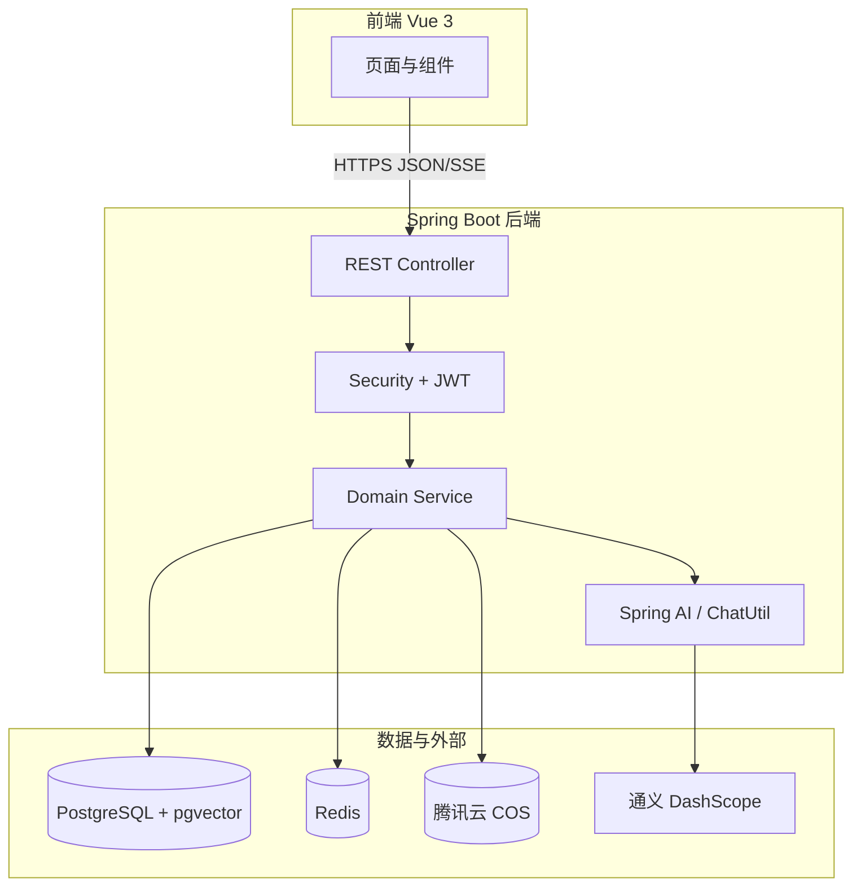
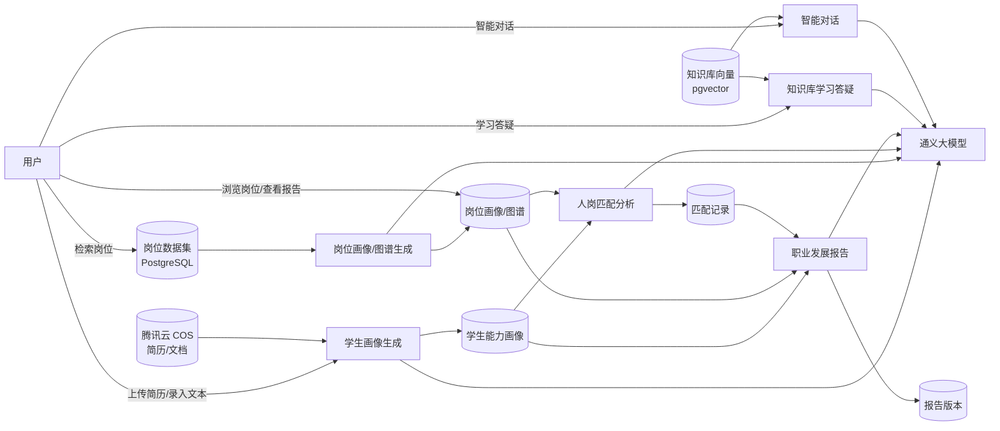

# 职点迷津：基于 AI 的大学生职业规划智能体——系统需求规约文档（SRS）

---

## 目录

1. [引言](#1-引言)
2. [系统概述](#2-系统概述)
3. [功能需求](#3-功能需求)
4. [非功能需求](#4-非功能需求)
5. [系统设计原则](#5-系统设计原则)
6. [技术选型](#6-技术选型)
7. [数据流图](#7-数据流图)
8. [总结](#8-总结)

---

## 1 引言

### 1.1 项目背景

- **项目名称**：职点迷津 — 基于 AI 的大学生职业规划智能体
- **项目总体目标**：
  1. 构建面向计算机类信息化岗位的**就业岗位要求画像**与**岗位关联图谱**，帮助学生理解岗位技能要求与发展路径；
  2. 支持简历上传或文本录入，利用大语言模型生成**学生就业能力画像**，并给出完整度与能力评分；
  3. 在「基础要求、职业技能、职业素养、发展潜力」四维权重框架下完成**可解释的人岗匹配分析**；
  4. 聚合画像、匹配结果与职业路径，生成**可操作、可编辑、可导出**的职业生涯发展报告；
  5. 提供**求职准备阶段**的知识库与学习答疑能力，支持上传学习/项目类资料并针对材料提问，辅助知识积累与项目梳理（与面试模拟等后续环节区分）；
  6. 提供**独立智能对话**，支持按需选用系统知识库与用户知识文档辅助回答。

### 1.2 大学生职业规划痛点

针对上述就业与规划困境，本系统重点回应以下痛点：

1. **自我认知模糊**：专业与能力选择缺乏系统剖析，易跟风考研、考公或进大厂，忽视个人特质与岗位匹配。
2. **职业信息片面**：对行业与岗位的认知多来自社交媒体碎片信息，对新兴领域技能要求与风险判断不足。
3. **外部指导薄弱**：高校课程偏理论，缺乏贴合一线的个性化建议；家庭干预过度或缺位。
4. **规划难以落地**：缺少实习与项目验证，面对行业快速迭代缺乏动态调整能力。

### 1.3 用户期望与系统指标

学生通过本系统应能够：

| 序号 | 用户期望                                     | 系统对应能力                                             |
| ---- | -------------------------------------------- | -------------------------------------------------------- |
| 1    | 快速了解应届生岗位能力要求，并拆解具体能力项 | 岗位库检索、岗位能力画像（七维）、岗位关键词             |
| 2    | 清晰分析自身就业能力与就业意愿               | 简历/文本解析、学生能力画像、能力评分与完整度评分        |
| 3    | 获得可操作的生涯报告与行动计划               | 人岗匹配、职业图谱、发展报告（探索/目标/路径/计划/评估） |

**系统核心指标（需求编号）**：

| 指标类别 | 要求摘要                                              | 本系统需求编号 |
| -------- | ----------------------------------------------------- | -------------- |
| 岗位画像 | ≥10 个岗位类型画像；六维能力要求                     | FR-JOB-01      |
| 岗位图谱 | 垂直晋升路径；≥5 条换岗路径，每条 ≥2 节点           | FR-JOB-02      |
| 学生画像 | 简历上传或录入；七维画像；完整度/能力评分             | FR-STU-01      |
| 生涯报告 | 探索匹配、目标与路径、短中期计划、润色/检查/编辑/导出 | FR-RPT-01      |
| 人岗匹配 | 四维分析 + 权重综合打分；可解释                       | FR-MAT-01      |
| 大模型   | 至少一个 LLM 用于画像、匹配、报告等                   | NFR-AI-01      |
| 准确性   | 关键技能匹配率、画像关键信息准确率（评测）            | NFR-QA-01      |

---

## 2 系统概述

### 2.1 系统目标

系统旨在为在校大学生提供「数据驱动的职业规划智能体」，贯通岗位认知、能力自省、量化匹配与行动规划，支撑求职决策与长期发展。

#### 2.1.1 岗位与图谱目标

1. 管理计算机类信息化岗位数据集（约 1 万条原始记录），支持检索与详情查看。
2. 基于职位描述（JD）生成**岗位能力画像**。
3. 生成**垂直晋升图谱**与**换岗路径图谱**。
4. 覆盖不少于 **10 种**岗位角色类型的专用提示词与画像策略（如 Java 后端、前端、测试、算法、大数据等）。

#### 2.1.2 学生画像目标

1. 支持简历 PDF 或原始文本作为输入。
2. 将非结构化简历拆解为**七维就业能力画像**（专业技能、获奖经历、创新/学习/抗压/沟通/实习能力）。
3. 输出**能力评分**及分项明细、改进建议、岗位类型识别置信度。
4. 支持教育经历、项目经历、技能、求职意向等结构化档案维护。

#### 2.1.3 匹配与报告目标

1. 按“基础要求、职业技能、职业素养、发展潜力”四维对比岗位与学生画像，加权计算综合匹配度。
2. 输出维度得分、证据、亮点、差距、关键词命中/缺失及**关键技能匹配率**。
3. 生成结构化职业生涯发展报告，含职业探索、目标、路径、短中期行动计划与评估周期。
4. 支持报告智能润色、完整性检查、手动编辑与版本管理；简历分析结果支持 PDF 导出。

#### 2.1.4 平台与交互

1. 保障用户级数据隔离，各用户仅可访问本人数据。
2. 提供求职准备向知识库：文档上传、向量化索引与基于材料的学习答疑（非面试模拟）。
3. 提供多轮会话、消息历史；会话内可按需选用系统知识库与用户知识文档辅助回答。
4. 支持 Docker 一键部署与 CI 自动化测试。

### 2.2 系统功能概述

| 子系统                     | 功能摘要                                                           |
| -------------------------- | ------------------------------------------------------------------ |
| **简历与档案**       | 简历 CRUD、内容查询、教育/项目/技能/求职意向管理、简历 PDF 导出    |
| **学生能力画像**     | 从 PDF/文本生成画像、查询当前画像、能力评分与建议                  |
| **岗位服务**         | 岗位分页检索与筛选、CRUD、岗位能力画像生成/查询、职业图谱生成/查询 |
| **人岗匹配**         | 按岗位触发匹配分析、查询历史匹配、查询岗位默认权重                 |
| **职业发展报告**     | 按岗位生成报告、查询最新报告、润色、完整性检查、手动编辑保存       |
| **知识库与学习答疑** | 准备阶段资料管理、文档索引、基于材料的知识学习与项目相关答疑       |
| **会话与消息**       | 会话管理、流式聊天、可选引用系统/用户知识库                        |
| **文件服务**         | 简历文件、知识库文件上传                                           |

### 2.3 系统架构概述

系统采用**前后端分离 + 分层单体**架构：浏览器访问 Vue 3 前端，经 REST API 调用 Spring Boot 后端；业务数据持久化于 PostgreSQL（含 pgvector），会话与限流等使用 Redis；文件与大对象使用腾讯云 COS；核心智能能力通过 Spring AI 调用通义大模型（DashScope 兼容模式）。

#### 2.3.1 前端层

- **职责**：页面展示、表单交互、图谱与报告可视化、流式消息展示。
- **技术栈**：Vue 3、TypeScript、Vite、Pinia、Vue Router。
- **主要页面域**：首页门户、岗位列表/详情、能力画像、简历编辑、知识库、智能对话。

#### 2.3.2 后端层

- **职责**：业务编排、鉴权、LLM 结构化调用、向量检索、事务与异常统一处理。
- **技术栈**：Java 、Spring Boot 、Spring Security + JWT、MyBatis-Plus、Spring AI。
- **主要模块**：

| 模块                    | 职责                            |
| ----------------------- | ------------------------------- |
| `userAuthService`     | 用户注册登录、验证码、JWT       |
| `resumeService`       | 简历、档案、学生能力画像        |
| `jobService`          | 岗位、岗位画像、职业图谱        |
| `matchService`        | 人岗匹配                        |
| `careerReportService` | 职业发展报告                    |
| `knowledgeService`    | 知识库与 RAG                    |
| `conversationService` | 会话与消息                      |
| `common`              | 配置、异常、AI 工具、存储、限流 |

#### 2.3.3 持久化与外部服务层

- **PostgreSQL**：用户、岗位、画像、匹配记录、报告版本、知识库向量等。
- **Redis**：登录态、限流计数等。
- **腾讯云 COS**：简历 PDF、知识文档等对象存储。
- **DashScope（通义千问）**：大模型推理（结构化 JSON 输出、流式对话）。

#### 2.3.4 安全与运维支持

- 全站 API 鉴权（JWT），业务数据按 `userId` 隔离。
- RFC 9457 Problem Details + 业务错误码统一响应。
- Docker Compose 编排 PostgreSQL、Redis、后端；GitHub Actions CI 与单元测试门禁。

**图 2-1 系统逻辑架构（示意）**

这里需要更完善的图片



---

## 3 功能需求

本章从**用户视角**描述职点迷津对外提供的业务能力：用户是谁、要完成什么目标、看到什么结果、系统应如何反馈。接口、数据库、算法等实现细节不在本章展开。

**用户角色**

| 角色 | 说明                                                                     |
| ---- | ------------------------------------------------------------------------ |
| 用户 | 在册学生；可使用职业规划、画像、匹配、报告、知识库与对话等全部业务功能。 |

### UML 绘制通用约定

后续各小节「用例图 / 活动图绘制说明」供 draw.io 成图时使用，约定如下：

| 元素                           | 约定                                                                                           |
| ------------------------------ | ---------------------------------------------------------------------------------------------- |
| **用例图**               | 参与者用小人；系统边界用矩形框，标题为「职点迷津」；用例用椭圆；关联用实线                     |
| **包含** `<<include>>` | 主用例必然调用的子步骤（如「生成能力画像」包含「校验简历内容」）                               |
| **扩展** `<<extend>>`  | 可选分支（如「导出简历 PDF」扩展「管理简历与档案」）                                           |
| **活动图泳道**           | 三泳道：**用户** \| **职点迷津系统** \| **智能分析服务**（大模型与知识检索） |
| **活动节点**             | 圆角矩形；**判断**用菱形；起/止用实心圆/同心圆                                           |
| **表述粒度**             | 泳道内写用户可感知或业务步骤，不写接口路径、类名、表名                                         |

---

### 3.1 简历与个人就业能力画像

#### 3.1.1 功能概述

学生上传简历或录入经历后，系统将其整理为结构化的**就业能力画像**，从多维度描述「我会什么、强在哪里、待提升什么」，并给出能力评分与改进建议，作为后续岗位匹配与生涯报告的基础。

#### 3.1.2 用例图

**图 3-1 学生能力画像用例图**

**绘制说明**

| 项       | 内容                                     |
| -------- | ---------------------------------------- |
| 系统边界 | 矩形框，标题「职点迷津 — 学生能力画像」 |
| 参与者   | **用户**（1 个，置于边界左侧）     |
| 用例数量 | **6 个**（均置于边界内）           |

**用例清单与关联**

| 用例           | 说明                             | 与参与者 | 用例间关系                                                                                             |
| -------------- | -------------------------------- | -------- | ------------------------------------------------------------------------------------------------------ |
| 管理简历与档案 | 维护教育、项目、技能、求职意向等 | 关联     | —                                                                                                     |
| 上传简历文件   | 上传 PDF 导入经历                | 关联     | 被「生成能力画像」**包含**（PDF 路径）                                                           |
| 录入简历文本   | 粘贴或输入纯文本                 | 关联     | 被「生成能力画像」**包含**（文本路径）                                                           |
| 生成能力画像   | 触发智能分析，产出七维画像与评分 | 关联     | **包含**「校验简历内容非空」；**包含**「识别求职方向类型」（内部子用例，可画小椭圆或注释） |
| 查询能力画像   | 打开已保存的最新画像             | 关联     | —                                                                                                     |
| 导出简历 PDF   | 将编辑后的简历导出为 PDF         | 关联     | **扩展**「管理简历与档案」（可选操作）                                                           |

**关系示意（供 draw.io 连线）**

```
用户 ── 管理简历与档案
用户 ── 生成能力画像 ──<<include>>── 上传简历文件
                    ──<<include>>── 录入简历文本
                    ──<<include>>── 校验简历内容非空（子用例，可选）
用户 ── 查询能力画像
用户 ── 管理简历与档案 <<extend>> 导出简历 PDF
```

**用例价值表（正文保留）**

| 用例           | 用户价值                                 |
| -------------- | ---------------------------------------- |
| 管理简历与档案 | 维护教育、项目、技能、求职意向等基础信息 |
| 上传简历文件   | 用 PDF 快速导入经历，减少手工录入        |
| 生成能力画像   | 一键获得多维度能力解读与评分             |
| 查询能力画像   | 随时查看最新画像与历史分析结果           |
| 导出简历 PDF   | 将编辑好的简历导出为可投递的 PDF         |

#### 3.1.3 活动图

**图 3-2 生成学生能力画像活动图**

**绘制说明**

| 项       | 内容                                                               |
| -------- | ------------------------------------------------------------------ |
| 对应用例 | 「生成能力画像」                                                   |
| 泳道     | **用户** \| **职点迷津系统** \| **智能分析服务** |
| 起点     | 用户进入「能力画像」页，点击「生成画像」                           |
| 终点     | 成功：展示画像与评分；失败：展示错误提示并可重试                   |

**主流程（顺序活动）**

1. **用户**：选择录入方式。
2. **判断**「录入方式？」
   - **分支 A — PDF**：用户选择 PDF 并上传 → **系统**接收文件、存入对象存储 → **系统**解析 PDF 为文本。
   - **分支 B — 文本**：用户在表单粘贴/输入文本 → **系统**接收文本。
   - 两分支在「已取得简历正文」处**合并**。
3. **判断**「正文是否为空？」
   - **是** → **系统**提示「内容为空，请重新上传或录入」→ **终止**（可回到步骤 1）。
   - **否** → 继续。
4. **系统**：展示「分析中…」加载状态。
5. **智能分析服务**：识别求职方向类型（规则 + 大模型兜底）→ 按方向选择分析策略 → 生成七维能力画像、能力评分、改进建议、方向置信度。
6. **判断**「分析是否成功？」
   - **否**（解析失败 / 超时 / 模型异常）→ **系统**提示具体原因 → **终止**（用户可重试）。
   - **是** → 继续。
7. **系统**：保存或更新当前用户的画像记录（覆盖为最新版）。
8. **用户**：查看能力评分、七维说明、改进建议与方向提示。

**异常与分支汇总**

| 分支点   | 条件        | 走向                               |
| -------- | ----------- | ---------------------------------- |
| 录入方式 | PDF / 文本  | 两条互斥分支后合并                 |
| 正文校验 | 空 / 非空   | 空则失败终止                       |
| PDF 解析 | 成功 / 失败 | 失败提示「文件无法识别」           |
| 智能分析 | 成功 / 失败 | 失败提示「分析超时或失败，请重试」 |
| 重复生成 | 已有画像    | 仍走同一流程，最终覆盖为最新结果   |

#### 3.1.4 功能需求

| 编号      | 功能     | 用户操作与系统表现                                                                                                                             |
| --------- | -------- | ---------------------------------------------------------------------------------------------------------------------------------------------- |
| FR-STU-01 | 录入方式 | 支持上传简历 PDF，或直接输入/粘贴简历文本；至少提供一种有效内容方可生成画像。                                                                  |
| FR-STU-02 | 能力维度 | 画像从**专业技能、荣誉与证书、创新能力、学习能力、抗压能力、沟通能力、实习与实践能力**等维度呈现，文字说明须可读、可理解，避免空泛套话。 |
| FR-STU-03 | 能力评分 | 提供 0～100 分的**能力评分**及简要解读；可附带简历完整度、内容质量等分项说明，帮助学生知悉「强在哪、弱在哪」。                           |
| FR-STU-04 | 改进建议 | 给出可执行的改进建议列表（如补充项目经历、强化某类技能），与画像内容一致。                                                                     |
| FR-STU-05 | 方向识别 | 可提示系统推断的求职方向类型及置信程度，供学生参考（非强制采纳）。                                                                             |
| FR-STU-06 | 简历编辑 | 支持在线编辑简历、多模板预览；可维护教育、项目、技能、求职意向等模块。                                                                         |
| FR-STU-07 | 结果留存 | 生成后的画像可再次打开查看，无需每次重新上传简历（除非用户主动更新并重新生成）。                                                               |

#### 3.1.5 业务规则

- 分析结论应基于用户提供的简历/文本，**不得虚构**用户未提及的技能或经历。
- 同一份材料重新生成时，覆盖或更新为最新版本，并向用户标明为最新结果。

---

### 3.2 岗位浏览、岗位画像与职业路径

#### 3.2.1 功能概述

学生可浏览真实岗位信息，查看岗位的任职要求，并查看该岗位在职场中的**晋升路径**与**可转换的其他岗位方向**，从而建立对就业市场的清晰认知。

#### 3.2.2 用例图

**图 3-3 岗位与图谱用例图**

**绘制说明**

| 项       | 内容                           |
| -------- | ------------------------------ |
| 系统边界 | 「职点迷津 — 岗位与职业路径」 |
| 参与者   | **用户**（1 个）         |
| 用例数量 | **6 个**                 |

**用例清单与关联**

| 用例             | 说明                             | 用例间关系                                                                       |
| ---------------- | -------------------------------- | -------------------------------------------------------------------------------- |
| 检索筛选岗位     | 列表分页、多条件筛选             | —                                                                               |
| 查看岗位详情     | 阅读 JD、公司、薪资等            | 被「生成岗位能力画像」「生成职业路径图」**包含**（需先选定岗位）           |
| 生成岗位能力画像 | 对当前岗位触发/requirements 分析 | **包含**「查看岗位详情」；与「查询岗位能力画像」互斥触发（有缓存则走查询） |
| 查询岗位能力画像 | 打开已生成的岗位画像             | **扩展**「查看岗位详情」（当画像已存在时）                                 |
| 生成职业路径图   | 生成晋升与换岗图谱               | **包含**「查看岗位详情」                                                   |
| 查询职业路径图   | 打开已生成的图谱                 | **扩展**「查看岗位详情」（当图谱已存在时）                                 |

**关系示意**

```
用户 ── 检索筛选岗位 ──<<include>>── 查看岗位详情
用户 ── 查看岗位详情
用户 ── 查看岗位详情 <<extend>> 查询岗位能力画像
用户 ── 查看岗位详情 <<extend>> 生成岗位能力画像
用户 ── 查看岗位详情 <<extend>> 查询职业路径图
用户 ── 查看岗位详情 <<extend>> 生成职业路径图
```

| 用例                  | 用户价值                                       |
| --------------------- | ---------------------------------------------- |
| 检索/筛选岗位         | 按行业、薪资、公司、职位名称等条件找到目标岗位 |
| 查看岗位详情          | 了解职位描述、公司情况、薪资与地点等           |
| 生成/查询岗位能力画像 | 将冗长招聘说明提炼为结构化的能力要求           |
| 生成/查询职业关联图谱 | 查看晋升阶梯与换岗可能性                       |

#### 3.2.3 活动图

**图 3-4 生成岗位职业图谱活动图**

**绘制说明**

| 项       | 内容                                                                                     |
| -------- | ---------------------------------------------------------------------------------------- |
| 对应用例 | 「生成职业路径图」（岗位能力画像生成流程类似，节点可复用，差异在输出为七维要求而非图谱） |
| 泳道     | **用户** \| **职点迷津系统** \| **智能分析服务**                       |
| 起点     | 用户在岗位详情页点击「生成职业路径图」或「查看路径图」                                   |
| 终点     | 展示垂直晋升路径 + 换岗路径；或提示失败                                                  |

**主流程**

1. **用户**：在岗位详情页操作（生成或查看）。
2. **判断**「本地是否已有图谱？」（用户点击「查看」或系统自动检测）
   - **是** → **系统**读取已存图谱 → 跳转步骤 8（直接展示）。
   - **否** / 用户点击「重新生成」→ 继续步骤 3。
3. **系统**：加载岗位详情（JD、关键词等）→ 展示「生成中…」。
4. **智能分析服务**：识别岗位类型（规则 + 大模型）→ 按类型选择图谱生成策略 → 输出垂直晋升路径（≥3 节点）、换岗路径（≥5 条，每条 ≥2 节点）、当前岗位节点、总结说明。
5. **系统**：校验图谱结构是否满足数量要求（节点数不足则视为失败）。
6. **判断**「校验是否通过？」
   - **否** → 提示「图谱生成失败，请稍后重试」→ **终止**。
   - **是** → 继续。
7. **系统**：保存/更新该岗位的图谱（同一岗位仅保留一条最新记录）。
8. **用户**：在页面查看晋升阶梯、换岗路线及「当前关注岗位」标注。

**补：生成岗位能力画像（图 3-4 可另绘或作为注释分支）**

- 与步骤 3～7 类似，但输出为**七维岗位能力要求**（专业技能、证书、创新/学习/抗压/沟通/实践等）及优势/缺口说明，不校验路径节点数。

**分支汇总**

| 分支点       | 条件                   | 走向                     |
| ------------ | ---------------------- | ------------------------ |
| 是否已有结果 | 有 / 无 / 强制重新生成 | 有则短路展示；无则走 LLM |
| 结构校验     | 通过 / 不通过          | 不通过则失败（图谱专用） |
| 岗位不存在   | 有效 / 无效            | 无效提示「岗位不存在」   |

#### 3.2.4 功能需求

| 编号      | 功能         | 用户操作与系统表现                                                                                                                               |
| --------- | ------------ | ------------------------------------------------------------------------------------------------------------------------------------------------ |
| FR-JOB-01 | 岗位浏览     | 提供岗位列表与多条件筛选（如行业、公司规模、薪资区间、实习/全职、职位关键词等）；点击进入详情页查看完整招聘信息。                                |
| FR-JOB-02 | 岗位能力画像 | 用户可对某岗位生成「能力要求画像」，从专业技能、证书资质、创新/学习/抗压/沟通/实践等维度归纳**该岗位需要什么**；支持再次打开已生成的画像。 |
| FR-JOB-03 | 岗位类型覆盖 | 系统须支持不少于**10 类**常见信息化岗位（如后端开发、前端、测试、算法、数据分析、运维、安全等）的能力解读，避免仅适用于单一岗位。          |
| FR-JOB-04 | 垂直晋升路径 | 职业图谱中展示从当前/入门岗位向上的晋升序列（不少于 3 个层级），含岗位名称、职责要点、能力要求、典型成长年限等。                                 |
| FR-JOB-05 | 换岗路径     | 展示不少于**5 条**可转换的职业方向；每条路径不少于 **2 个**阶段节点，并说明转岗理由、难度及需补齐的能力。                            |
| FR-JOB-06 | 当前位置标注 | 图谱中明确标出「当前关注岗位」在路径中的位置，便于学生对照自身目标。                                                                             |

#### 3.2.5 业务规则

- 岗位数据来源于系统预置的岗位库（含职位名称、地点、薪资、公司、行业、职位描述等）。
- 能力画像与职业图谱以岗位招聘说明为依据归纳；招聘说明中未提及的要求应标注为「未明确」或同等语义，避免误导。

---

### 3.3 人岗匹配分析

#### 3.3.1 功能概述

在学生已具备**个人能力画像**且目标岗位已具备**岗位能力画像**的前提下，学生可发起匹配分析，系统从多个维度对比「岗位要求」与「我的能力」，给出综合匹配度、分项得分、优势亮点与待补齐差距，帮助学生对该岗位的契合度。

#### 3.3.2 用例图

**图 3-5 人岗匹配用例图**

**绘制说明**

| 项       | 内容                         |
| -------- | ---------------------------- |
| 系统边界 | 「职点迷津 — 人岗匹配分析」 |
| 参与者   | **用户**（1 个）       |
| 用例数量 | **4 个**               |

**用例清单与关联**

| 用例             | 说明                           | 用例间关系                                                                                                                            |
| ---------------- | ------------------------------ | ------------------------------------------------------------------------------------------------------------------------------------- |
| 发起人岗匹配     | 对指定岗位触发四维对比分析     | **包含**「校验匹配前置条件」                                                                                                    |
| 校验匹配前置条件 | 检查个人画像、岗位画像是否齐备 | 被「发起匹配」包含；失败时**extend** 出「引导补全画像」（子用例，虚线到「生成能力画像」「生成岗位能力画像」可画在边界外作注释） |
| 查看匹配结果     | 打开该岗位最近一次匹配结果     | —                                                                                                                                    |
| 重新匹配         | 画像更新后再次分析             | **扩展**「查看匹配结果」（可选）；覆盖原结果                                                                                    |

**关系示意**

```
用户 ── 发起人岗匹配 ──<<include>>── 校验匹配前置条件
用户 ── 查看匹配结果
用户 ── 查看匹配结果 <<extend>>── 重新匹配
```

#### 3.3.3 活动图

**图 3-6 人岗匹配活动图**

**绘制说明**

| 项       | 内容                                                               |
| -------- | ------------------------------------------------------------------ |
| 对应用例 | 「发起人岗匹配」                                                   |
| 泳道     | **用户** \| **职点迷津系统** \| **智能分析服务** |
| 起点     | 用户在岗位详情/匹配入口点击「分析匹配度」                          |
| 终点     | 展示四维分数、综合匹配度、优势/差距/技能覆盖说明                   |

**主流程**

1. **用户**：选择目标岗位并点击「分析匹配度」。
2. **系统**：校验岗位是否存在。
3. **判断**「个人能力画像是否存在？」
   - **否** → **系统**提示「请先完成个人能力画像」并提供跳转 → **终止**。
   - **是** → 继续。
4. **判断**「岗位能力画像是否存在？」
   - **否** → **系统**自动触发岗位画像生成（进入智能分析，同 3.2 节）→ 合并后继续。
   - **是** → 继续。
5. **系统**：按岗位类型加载四维权重配置（基础要求 / 职业技能 / 职业素养 / 发展潜力）→ 展示「匹配分析中…」。
6. **智能分析服务**：汇总岗位 JD、岗位七维画像、学生七维画像、岗位关键词 → 四维分别打分并生成优势点、差距点、技能命中/缺失列表、文字总结。
7. **系统**：根据权重重算综合匹配度与关键技能匹配率（保证与配置一致）→ 保存/覆盖该用户在该岗位的匹配记录。
8. **用户**：查看雷达或分数、综合匹配度、可解释说明与技能覆盖情况。

**分支汇总**

| 分支点   | 条件        | 走向                                             |
| -------- | ----------- | ------------------------------------------------ |
| 学生画像 | 有 / 无     | 无则前置提示终止                                 |
| 岗位画像 | 有 / 无     | 无则系统自动生成后继续                           |
| 分析结果 | 成功 / 失败 | 失败提示「匹配分析失败，请重试」                 |
| 重复匹配 | 已有历史    | 新结果覆盖，用户仍通过「查看匹配结果」打开最新版 |

#### 3.3.4 功能需求

| 编号      | 功能       | 用户操作与系统表现                                                                                                                                                                                 |
| --------- | ---------- | -------------------------------------------------------------------------------------------------------------------------------------------------------------------------------------------------- |
| FR-MAT-01 | 发起匹配   | 学生在岗位详情或匹配入口选择「分析匹配度」；分析完成后展示结果页。                                                                                                                                 |
| FR-MAT-02 | 分析维度   | 至少从以下四类对比并分别打分（0～100）：**基础要求**（学历、证书等）、**职业技能**（专业与技能匹配）、**职业素养**（沟通、抗压等）、**发展潜力**（学习、实践、成长空间）。 |
| FR-MAT-03 | 综合匹配度 | 在分项基础上给出**综合匹配度**（0～100），并说明各维度在综合分中的权重逻辑（可用通俗语言或图示，让学生理解「为何是这个总分」）。                                                             |
| FR-MAT-04 | 可解释说明 | 展示：与岗位匹配的优势点（若干条）、影响录用的关键差距（若干条）、已覆盖与未覆盖的岗位关键技能词、一段文字总结。说明须引用学生画像与岗位要求中的依据，避免空泛评价。                               |
| FR-MAT-05 | 历史结果   | 对同一岗位可查看最近一次匹配结果；用户更新画像后可重新分析并覆盖原结果。                                                                                                                           |
| FR-MAT-06 | 前置提示   | 若尚未生成个人画像或岗位画像，系统明确提示须先完成哪一步，并提供跳转入口（如「去生成能力画像」）。                                                                                                 |

#### 3.3.5 业务规则

- 仅分析**当前用户**本人的画像，不可查看他人匹配结果。
- 关键技能匹配程度应可理解（如「岗位要求的 10 项核心技能中，您已体现 8 项」）；系统内部质量目标为关键技能匹配率不低于 80%（见第 4 章非功能需求）。

---

### 3.4 职业生涯发展报告

#### 3.4.1 功能概述

针对某一目标岗位，系统为学生生成一份结构化的**职业生涯发展报告**：说明人与岗是否契合、可设定怎样的职业目标、中长期发展路径如何、短期与中期应完成哪些行动，并支持润色、完整性检查与手动修改，形成可指导实际行动的规划文档。

#### 3.4.2 用例图

**图 3-7 职业发展报告用例图**

**绘制说明**

| 项       | 内容                             |
| -------- | -------------------------------- |
| 系统边界 | 「职点迷津 — 职业生涯发展报告」 |
| 参与者   | **用户**（1 个）           |
| 用例数量 | **6 个**                   |

**用例清单与关联**

| 用例             | 说明                                         | 用例间关系                               |
| ---------------- | -------------------------------------------- | ---------------------------------------- |
| 生成职业发展报告 | 针对目标岗位一键生成结构化报告               | **包含**「校验报告前置条件」       |
| 校验报告前置条件 | 个人画像、岗位画像、匹配结果、职业图谱均齐备 | 被「生成报告」包含；缺项时分别提示并引导 |
| 查看报告         | 打开该岗位最新版报告                         | —                                       |
| 润色报告         | 在事实不变前提下优化表述，产生新版本         | **扩展**「查看报告」               |
| 完整性检查       | 检查缺章、过短等并给评分与建议               | **扩展**「查看报告」               |
| 编辑保存报告     | 用户手工修改并保存新版本                     | **扩展**「查看报告」               |

**关系示意**

```
用户 ── 生成职业发展报告 ──<<include>>── 校验报告前置条件
用户 ── 查看报告
用户 ── 查看报告 <<extend>>── 润色报告
用户 ── 查看报告 <<extend>>── 完整性检查
用户 ── 查看报告 <<extend>>── 编辑保存报告
```

#### 3.4.3 活动图

**图 3-8 生成职业发展报告活动图**

**绘制说明**

| 项       | 内容                                                               |
| -------- | ------------------------------------------------------------------ |
| 对应用例 | 「生成职业发展报告」                                               |
| 泳道     | **用户** \| **职点迷津系统** \| **智能分析服务** |
| 起点     | 用户选定岗位并点击「生成报告」                                     |
| 终点     | 分段展示报告；或提示缺项/失败                                      |

**主流程**

1. **用户**：在岗位上下文点击「生成职业发展报告」，可选填写偏好或关注重点。
2. **系统**：逐项校验前置数据——
   - 个人能力画像
   - 该岗位能力画像（缺失则自动生成）
   - 人岗匹配结果（缺失则自动触发匹配）
   - 职业路径图谱（缺失则自动生成）
     **判断**「是否仍有缺项？」→ **是**则逐项提示用户先完成对应步骤 → **终止**。
3. **系统**：聚合上述四类结果 → 展示「报告生成中…」。
4. **智能分析服务**：生成结构化报告正文，须包含五章——职业探索、职业目标、发展路径（引用图谱）、短中期行动计划（每阶段 ≥3 条可执行任务）、评估与调整；不得编造简历或 JD 中不存在的内容。
5. **系统**：本地完整性预检（章节是否齐全、计划条数等）→ 写入新版本（旧版标记为非最新）→ 记录完整度评分。
6. **判断**「生成是否成功？」
   - **否** → 提示失败原因 → **终止**。
   - **是** → 继续。
7. **用户**：阅读报告；可后续选择润色、完整性检查或手工编辑（另用短流程，可不画在本图）。

**与 3.5 知识库的边界**

- 报告生成**不依赖**用户在知识库中的文档（主线独立）；绘制本图时**不要**从知识库泳道连入。

**分支汇总**

| 分支点     | 条件                | 走向                               |
| ---------- | ------------------- | ---------------------------------- |
| 前置四件套 | 齐全 / 缺一项或多项 | 缺则提示+终止；部分可自动补全      |
| 生成       | 成功 / 失败         | 失败可重试                         |
| 版本       | 首次 / 再次生成     | 均产生新版本，最新版标记给用户查看 |

#### 3.4.4 功能需求

| 编号      | 功能         | 用户操作与系统表现                                                                                                                                                                                                                                                     |
| --------- | ------------ | ---------------------------------------------------------------------------------------------------------------------------------------------------------------------------------------------------------------------------------------------------------------------- |
| FR-RPT-01 | 生成报告     | 用户选择目标岗位后一键生成；生成中显示进度或等待提示；完成后在页面分段展示报告。                                                                                                                                                                                       |
| FR-RPT-02 | 报告章节     | 报告须包含：**职业探索**（市场与岗位、人与岗契合与差距）、**职业目标**、**发展路径**（结合岗位晋升/换岗图谱）、**行动计划**（短期与中期，每阶段不少于 3 条可执行任务，含建议周期与验收方式）、**评估与调整**（何时复盘、关注哪些指标）。 |
| FR-RPT-03 | 可操作性     | 计划项须具体可执行（如学习某技能、完成某类实习、考取某证书），避免仅「努力学习」「提升能力」等空话。                                                                                                                                                                   |
| FR-RPT-04 | 真实性       | 不得编造用户简历中不存在的经历或岗位中不存在的要求；可标注依据来源（如来自匹配分析、职业路径图）。                                                                                                                                                                     |
| FR-RPT-05 | 智能润色     | 用户可对已有报告发起「润色」，在保持事实不变的前提下优化表述，生成新版本供对比或采用。                                                                                                                                                                                 |
| FR-RPT-06 | 完整性检查   | 用户可一键检查报告是否缺章、过短或关键项未填；系统给出完整度评分与缺失项清单及修改建议。                                                                                                                                                                               |
| FR-RPT-07 | 手动编辑     | 用户可直接修改报告内容并保存；保存后形成新版本，保留「最新版」标识。                                                                                                                                                                                                   |
| FR-RPT-08 | 再次查看     | 对同一岗位可打开最近一次生成的报告，无需重复生成（除非用户主动重新生成）。                                                                                                                                                                                             |
| FR-RPT-09 | 导出（规划） | 支持将报告导出或打印为 PDF/文档，便于提交导师或自用（若当前版本仅支持在线阅读，应在界面说明）。                                                                                                                                                                        |

#### 3.4.5 业务规则

- 生成报告前，须已完成**个人能力画像**、该岗位的**岗位能力画像**、**人岗匹配分析**及**职业路径图谱**；缺项时逐项提示。

---

### 3.5 求职准备知识库与学习答疑

#### 3.5.1 功能概述

本模块面向**求职准备阶段**（投递与面试之前），帮助学生围绕**知识学习、项目理解与材料消化**开展积累，而非模拟面试或面经训练。

学生可上传与准备相关的个人资料，例如：专业课程与笔记、技术学习文档、**项目说明/复盘材料**、竞赛或科研记录、行业与岗位认知类读物等；在**个人知识库**中可存放多份文件，针对已上传内容提问，系统结合文档检索与通用能力作答，支持：

- **知识学习**：解释概念、梳理知识脉络、对照资料回答「是什么 / 为什么 / 怎么学」；
- **项目分析**：结合用户上传的项目描述，协助厘清技术栈、个人贡献、亮点与可改进点（须基于材料，不编造未提及经历）；
- **准备答疑**：对材料中的疑难句段、术语或规划类问题作连续追问。

本模块与画像、匹配、报告等**主线职业规划功能相互独立**，不自动引用其他模块的分析结果；**也不承担**面试题演练、模拟面试、面经对答等**面试阶段**能力（见 8.2 未来计划中的模拟面试项）。

#### 3.5.2 用例图（绘制说明，可选成图）

| 项       | 内容                                     |
| -------- | ---------------------------------------- |
| 系统边界 | 「职点迷津 — 求职准备知识库与学习答疑」 |
| 参与者   | **用户**（1 个）                   |
| 用例数量 | **6 个**                           |

| 用例             | 说明                                         | 用例间关系                                                            |
| ---------------- | -------------------------------------------- | --------------------------------------------------------------------- |
| 管理个人知识库   | 查看个人知识库及已上传文档列表               | —                                                                    |
| 上传准备资料     | 添加课程笔记、项目文档、学习材料等           | **包含**「校验文档格式与大小」                                  |
| 删除文档         | 移除已上传文档                               | —                                                                    |
| 查看文档处理状态 | 查看「处理中 / 已完成 / 失败」               | **扩展**「上传准备资料」                                        |
| 学习答疑         | 针对已索引文档提问并获得流式回答             | **包含**「检索相关文档片段」；**不包含**主线画像/匹配数据 |
| 项目材料梳理     | 基于用户上传的项目说明，问答式梳理结构与要点 | **扩展**「学习答疑」（当问题聚焦项目分析时）                    |

**活动图（可选，建议单独成图）：上传资料与学习答疑**

- **起点**：用户上传准备阶段资料，或就已有资料发起提问。
- **上传支路**：选择文件 → 校验 → 保存 → 异步解析、分块、向量化 → 状态变为「可答疑」。
- **答疑支路**：用户输入学习/项目类问题 → 检索文档片段 → 流式生成回答 → 可多轮追问。
- **终点**：用户获得基于材料的解答；失败可重试或更换资料。
- **泳道**：用户 \| 职点迷津系统 \| 智能分析服务（嵌入、检索与生成）。

#### 3.5.3 功能需求

| 编号     | 功能         | 用户操作与系统表现                                                                                                                                           |
| -------- | ------------ | ------------------------------------------------------------------------------------------------------------------------------------------------------------ |
| FR-KB-01 | 知识库管理   | 每位用户拥有一个个人知识库集合；可在其中上传、删除多份文档（支持常见文档格式，如课程笔记、项目说明等）。                                                     |
| FR-KB-02 | 文档处理     | 上传后系统后台完成解析与索引；处理中提示「处理中」，完成后可用于学习答疑。                                                                                   |
| FR-KB-03 | 学习答疑     | 用户就**已上传材料**提问（如概念理解、学习路径、项目技术点、经历表述等）；系统流式输出回答，优先依据知识库检索结果，并支持多轮连续追问。               |
| FR-KB-04 | 数据隔离     | 用户仅能访问本人的知识库与文档，无法查看他人资料。                                                                                                           |
| FR-KB-05 | 准备阶段定位 | 模块能力边界为求职**准备阶段**；不提供模拟面试、结构化面经问答或「以面试官视角打分」等**面试阶段**功能；回答须基于用户材料，不得虚构项目或经历。 |

---

### 3.6 智能对话

#### 3.6.1 功能概述

学生可在**独立**对话界面进行多轮职业相关提问与交流（不局限于某一份上传文档）。系统在同一会话内记住上下文并流式返回答案。**当前版本**对话不自动携带能力画像、人岗匹配或职业发展报告等主线分析结果；用户若需结合上述结论，须自行在问题中说明。

用户可按需选择是否在回答时引用以下知识来源（可单独开启、同时开启或均不开启）：

- **系统知识库**：平台维护的通用就业与学习类资料（如行业认知、技能学习路径、岗位通用要求等），供全体用户只读检索；
- **用户知识文档**：本人在 **3.5** 中上传并已索引的准备阶段资料（课程笔记、项目说明等）。

未启用任何知识来源时，系统仅依据会话历史与一般模型能力作答；启用后，系统在生成回答前检索相应来源中的相关片段并融入回答；若无有效命中，须说明并退回一般作答，**不得编造**文档中不存在的内容。

与 **3.5 学习答疑** 的区分：3.5 为知识库专页，默认围绕**用户已上传材料**开展准备阶段学习与项目梳理；3.6 为通用对话场景，知识引用为**可选项**，且可额外选用**系统知识库**；**不提供**模拟面试等面试阶段能力。

#### 3.6.2 用例图（绘制说明，可选成图）

| 项       | 内容                     |
| -------- | ------------------------ |
| 系统边界 | 「职点迷津 — 智能对话」 |
| 参与者   | **用户**（1 个）   |
| 用例数量 | **5 个**           |

| 用例         | 说明                                             | 用例间关系                                                                               |
| ------------ | ------------------------------------------------ | ---------------------------------------------------------------------------------------- |
| 管理会话     | 新建、查看列表、进入、删除对话主题               | —                                                                                       |
| 配置知识来源 | 选择是否引用系统知识库、用户知识文档（可均不选） | **扩展**「管理会话」或作为发送前步骤                                               |
| 发送消息     | 输入问题并提交                                   | **包含**「保存用户消息」；若已启用知识来源则 **include**「检索选定知识片段」 |
| 接收流式回复 | 逐段显示助手回答                                 | **包含**「调用对话模型」                                                           |
| 查看历史消息 | 翻阅会话内过往问答                               | **扩展**「管理会话」                                                               |

#### 3.6.3 活动图（绘制说明，可选成图）

**对应用例**：「配置知识来源 / 发送消息 / 接收流式回复」

| 项   | 内容                                                               |
| ---- | ------------------------------------------------------------------ |
| 泳道 | **用户** \| **职点迷津系统** \| **智能分析服务** |
| 起点 | 用户进入会话（可选先配置知识来源）并输入问题发送                   |
| 终点 | 助手回复完整展示并写入历史                                         |

**主流程**

1. **用户**（可选）：在会话中设置是否引用**系统知识库**、**用户知识文档**；设置对后续消息生效，可随时修改。
2. **用户**：输入文字并发送。
3. **系统**：校验会话归属 → 保存用户消息 → 若为首次消息则自动生成会话标题。
4. **系统**：创建助手消息占位，建立流式通道，展示「正在输入…」。
5. **判断**：是否启用了任一知识来源？
   - **是** → **智能分析服务**：按当前配置检索系统库和/或用户文档片段 → 将命中内容与会话历史一并送入模型；
   - **否** → **智能分析服务**：仅携带会话历史上下文生成回答（**不自动注入**画像/匹配/报告）。
6. **判断**：启用知识来源但无有效命中 → 说明未找到相关材料，退回一般作答。
7. **系统**：逐段推送文本至界面 → 完成后持久化助手消息。
8. **判断**失败分支：超时/中断 → 提示重试或恢复流式连接（若产品支持 resume）。
9. **用户**：继续多轮提问（回到步骤 2）或切换其他会话。

#### 3.6.4 功能需求

| 编号       | 功能         | 用户操作与系统表现                                                                                                                                             |
| ---------- | ------------ | -------------------------------------------------------------------------------------------------------------------------------------------------------------- |
| FR-CHAT-01 | 会话管理     | 用户可新建多个对话主题，查看历史会话列表，进入某会话继续交流。                                                                                                 |
| FR-CHAT-02 | 消息交互     | 用户发送文字问题，系统逐字或分段返回回答；长时间生成时显示「正在输入」或加载状态。                                                                             |
| FR-CHAT-03 | 历史记录     | 会话内历史消息可翻阅；用户可编辑某条已发送消息并重新生成后续回答（若产品提供该能力）。                                                                         |
| FR-CHAT-04 | 知识来源选择 | 用户可配置本会话是否引用**系统知识库**与**用户知识文档**（二者可独立开关）；启用后回答优先依据检索到的片段，无命中时须说明并退回一般作答，不编造。 |

---

## 4 非功能需求

### 4.1 性能需求

| 编号     | 要求                                                              |
| -------- | ----------------------------------------------------------------- |
| NFR-P-01 | 岗位列表分页查询：常规筛选条件下 P95 响应时间 ≤ 2s（不含冷启动） |
| NFR-P-02 | 结构化智能分析（画像/匹配/报告）：单次同步请求 P95 ≤ 60s         |
| NFR-P-03 | 流式对话首包延迟 ≤ 5s                                            |
| NFR-P-04 | 知识库向量检索 P95 ≤ 3s                                          |
| NFR-P-05 | 对登录态与热点数据采用缓存，降低数据库访问压力                    |

### 4.2 安全性需求

| 编号     | 要求                                                                                       |
| -------- | ------------------------------------------------------------------------------------------ |
| NFR-S-01 | 业务功能须登录后访问；未授权请求应被拒绝并引导重新登录                                     |
| NFR-S-02 | 用户数据按账号行级隔离，用户仅能访问本人简历、画像、匹配、报告与知识库                     |
| NFR-S-03 | 用户密码须加密存储；生产环境传输须采用 HTTPS 等安全协议                                    |
| NFR-S-04 | 登录、验证码及高频校验接口须限流，防止滥用                                                 |
| NFR-S-05 | 数据库、缓存、对象存储及模型服务等敏感凭据须通过部署环境配置注入，禁止硬编码或写入业务数据 |
| NFR-S-06 | 关键业务操作须记录可追溯日志；系统异常对用户仅展示友好提示，不暴露内部技术细节             |

### 4.3 可靠性与 AI 质量需求

| 编号      | 要求                                                                                           |
| --------- | ---------------------------------------------------------------------------------------------- |
| NFR-AI-01 | 至少接入一个大语言模型，支撑画像、匹配、报告、图谱与对话等智能能力                             |
| NFR-AI-02 | 智能分析结果须以结构化形式输出并可被系统稳定解析；解析或生成失败时须给出明确、可理解的失败说明 |
| NFR-AI-03 | 模型输出须严格依据用户提供的简历、岗位描述等输入证据，不得编造未出现的经历或能力               |
|           |                                                                                                |

### 4.4 可扩展性需求

| 编号     | 要求                                                                         |
| -------- | ---------------------------------------------------------------------------- |
| NFR-E-01 | 业务按功能域划分模块，新增岗位类型时仅需扩展相应规则与提示策略，不影响其他域 |
| NFR-E-02 | 人岗匹配权重须支持按目标岗位类型差异化配置                                   |
| NFR-E-03 | 对外提供规范的 HTTP 接口，并具备可自动生成的接口说明文档                     |
| NFR-E-04 | 每位用户拥有一个个人知识库集合，可在其中上传与管理多份文档                   |

### 4.5 可维护性需求

| 编号     | 要求                                                                     |
| -------- | ------------------------------------------------------------------------ |
| NFR-M-01 | 成功与失败响应格式须全站统一，便于前端对接与问题排查                     |
| NFR-M-02 | 业务错误须分类编号，并映射为一致的用户可见提示                           |
| NFR-M-03 | 岗位、鉴权、匹配、报告等核心模块须具备自动化测试，并在持续集成中自动执行 |
| NFR-M-04 | 关键模块具备可维护的设计说明，并与实现同步演进                           |
| NFR-M-05 | 须提供容器化或等效方式，便于开发与部署环境一键复现                       |

### 4.6 可用性与用户体验需求

| 编号     | 要求                                                       |
| -------- | ---------------------------------------------------------- |
| NFR-U-01 | 界面清晰分区：岗位探索、我的画像、匹配结果、报告、知识问答 |
| NFR-U-02 | 长耗时 AI 操作提供进度/加载与失败重试提示                  |
| NFR-U-03 | 匹配与报告结果面向学生语言，避免纯技术术语堆砌             |
| NFR-U-04 | 支持简历在线编辑与多模板预览                               |

---

## 5 系统设计原则

### 5.1 高内聚低耦合

- 按业务域划分模块（简历与画像、岗位、匹配、报告、知识库、对话等），各域职责边界清晰；
- 跨域流程（如报告生成需聚合画像、匹配与岗位信息）在业务编排层显式组合，避免散落多处；
- 用户请求入口层仅负责接收输入与返回结果，不编写业务规则与分支逻辑。

### 5.2 错误处理机制

- 可预期的业务失败（如资源不存在、前置条件未满足）须返回明确、一致的错误说明，便于用户理解与前端统一展示；
- 表单与参数校验失败须指出具体字段或原因；
- 未预期的系统异常须在服务端完整记录，对用户仅展示通用失败提示，不泄露内部细节；
- 智能分析生成失败须映射为对应业务场景的可读错误信息（如匹配分析失败、报告生成失败等）。

### 5.3 模块化与前后端分离

- 前端通过统一的远程调用层访问后端，页面与组件不直接拼装 HTTP 细节；
- 后端每个用户操作由单一业务入口处理，避免在接口层串联多条业务链路；
- 面向大模型的提示词与业务逻辑分离维护，便于按场景迭代调优而不改动核心流程代码。

### 5.4 接口设计原则

- 接口按业务资源组织（岗位、匹配、报告、知识库、会话等），路径语义清晰；
- 查询、创建、更新、删除等操作与常见 Web 惯例一致，降低对接成本；
- 成功与失败响应体结构全站统一：成功返回业务数据，失败返回用户可读说明及可识别的业务结果码。

### 5.5 可解释 AI 原则

- 匹配与报告须附带依据说明、能力差距与关键词清单，便于学生理解结论来源；
- 综合匹配分须按既定权重规则由系统重算，不能完全依赖模型主观打分；
- 职业图谱与路径节点须含职责说明与衔接技能描述，避免仅给出抽象标签。

---

## 6 技术选型

### 6.1 前端技术

| 技术       | 用途     | 选型理由                                   |
| ---------- | -------- | ------------------------------------------ |
| Vue 3      | SPA 界面 | 组件化、生态成熟，适合管理台与表单密集场景 |
| TypeScript | 类型约束 | 提升 API 契约与重构安全性                  |
| Vite       | 构建     | 快速冷启动与 HMR                           |
| Pinia      | 状态管理 | 用户信息、路由权限等全局状态               |
| Vue Router | 路由     | 分模块页面与登录守卫                       |

### 6.2 后端技术

| 技术                      | 用途     | 选型理由                                           |
| ------------------------- | -------- | -------------------------------------------------- |
| Java 21 + Spring Boot 3.5 | 业务服务 | 企业级生态成熟、易测试、便于团队协作与长期维护     |
| Spring Security + JWT     | 鉴权     | 无状态 API、前后端分离友好                         |
| MyBatis-Plus              | ORM      | 分页、条件构造、JSONB 类型处理                     |
| Spring AI                 | LLM 接入 | 统一 Chat/结构化输出，兼容 OpenAI API（DashScope） |

### 6.3 数据与中间件

| 技术                     | 用途             | 选型理由                 |
| ------------------------ | ---------------- | ------------------------ |
| PostgreSQL 15 + pgvector | 业务库与向量检索 | 单库同时支撑事务与 RAG   |
| Redis 7                  | 缓存/限流        | 低延迟会话与计数         |
| 腾讯云 COS               | 对象存储         | 简历 PDF、知识文档大文件 |

### 6.4 部署与工程化

| 技术           | 用途            | 选型理由                    |
| -------------- | --------------- | --------------------------- |
| Docker Compose | 本地/服务器编排 | 环境一致、快速复现          |
| GitHub Actions | CI              | 自动测试与构建              |
| Maven          | 构建与依赖      | 与 Spring Boot 官方实践一致 |

---

## 7 数据流图

**图 7-1 职业规划智能体顶层数据流图**



**数据流说明**：

1. **用户**：上传简历或输入文本，浏览岗位、触发画像/匹配/报告；在知识库模块进行准备阶段学习答疑；在对话模块进行独立会话，并可选择是否引用系统/用户知识库。
2. **岗位数据集**：存储企业导入的岗位原始字段，供检索与 JD 分析。
3. **学生画像生成**：PDF 经 COS 解析为文本 → LLM 结构化 → 写入 `student_capability_profiles`。
4. **岗位画像/图谱生成**：读取 JD → LLM 输出七维画像与图谱 → 写入 `job_capability_profiles`、`job_career_graphs`。
5. **人岗匹配**：聚合双画像与关键词 → LLM 四维打分 → 后端加权与关键词命中率 → `job_student_matches`。
6. **职业发展报告**：聚合画像、匹配与图谱 → LLM 生成报告内容 → 版本化存储（不引用知识库）。
7. **学习答疑**：文档向量化入 pgvector，用户就上传材料提问时检索增强生成（与报告、匹配流程无数据联动；面向准备阶段，非面试模拟）。
8. **智能对话**：按会话配置可选检索系统知识库与用户知识文档，结合历史上下文流式生成（不自动引用画像/匹配/报告）。

---

## 8 总结

### 8.1 需求分析总结

本文档定义**职点迷津**（基于 AI 的大学生职业规划智能体）的完整需求：从用户视角描述「能做什么、看到什么」；第 4 章及以后补充性能、安全、技术选型与数据流。

| 用户能力域 | 需求要点                                                                               |
| ---------- | -------------------------------------------------------------------------------------- |
| 认识市场   | 浏览岗位库、读懂岗位要求、查看晋升与换岗路径                                           |
| 认识自我   | 上传/录入简历，获得多维度能力画像与评分、建议                                          |
| 匹配决策   | 四维匹配度、优势与差距、可读懂的说明                                                   |
| 规划行动   | 生涯报告（探索/目标/路径/计划/评估）、润色与自检                                       |
| 准备与学习 | 个人知识库资料管理（多文件）、基于材料的学习答疑与项目梳理（独立模块，偏求职准备阶段） |
| 自由对话   | 多轮智能对话；可按需选用系统知识库与用户知识文档（独立模块，不自动引用主线分析结果）   |

非功能方面强调响应速度、隐私与数据隔离、分析结果可解释、分析依据真实；技术架构与接口设计原则见第 5～6 章。

### 8.2 未来开发计划

- **简历与能力画像**

  - 简历流程重构：上传 PDF/Word → 识别为结构化草稿 → 单页分区预览与字段级微调。
  - 自动维护求职画像：汇聚简历、对话、匹配与用户偏好，持续更新并支持溯源。
  - 计算机类求职领域模型：画像、匹配、报告等字段与计算机类求职场景对齐，随功能迭代持续演进。
- **职业规划与报告**

  - 职业规划流水线串联：画像、匹配、图谱与报告等步骤可单独执行或一键生成，中间结果可复用。
  - 职业发展报告增强：更贴合个人与岗位情况的可执行计划，探索版/深度版、润色与导出及质量抽检。
- **岗位探索与匹配**

  - 岗位向量相似度推荐：列表与搜索中按匹配度排序或展示「为你推荐」。
  - 人岗深度匹配增强：在推荐结果上对选定岗位做可解释的深度分析与反馈闭环。
  - 第三方招聘平台岗位接入：合规前提下扩充岗位数据来源。
- **知识库与学习答疑**

  - RAG 检索精度与速度优化。
  - 强化准备阶段场景（如项目材料结构化梳理、学习路径建议）的答疑质量。
- **用户体验**

  - 长耗时智能分析改为异步任务，提供进度展示与完成通知。

## 附录 A 图表索引

| 图号                  | 图题                         | 章节    |
| --------------------- | ---------------------------- | ------- |
| 图 3-1                | 学生能力画像用例图           | 第 3 章 |
| 图 3-2、3-4、3-6、3-8 | 画像、图谱、匹配、报告活动图 | 第 3 章 |
| 图 3-3、3-5、3-7      | 岗位、匹配、报告用例图       | 第 3 章 |
| 图 7-1                | 职业规划智能体顶层数据流图   | 第 7 章 |
